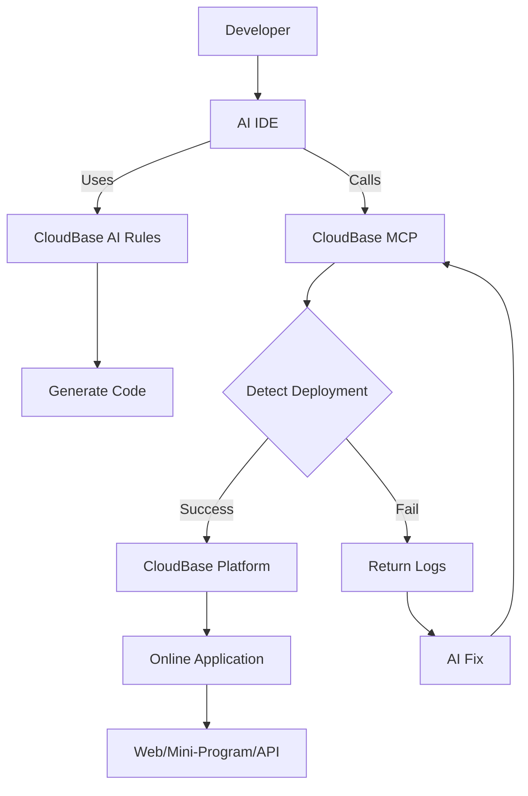

<div align="center">

.png)

# 🌟 CloudBase AI ToolKit

**🪐 Generate, deploy, and host your full-stack Web applications, mini-programs, databases, and backend services with AI IDE in one click—no DevOps required, launch your ideas at lightning speed 💫**

**🌍 Languages:** [中文](README.md) | **English**

[](https://opensource.org/licenses/MIT)
[](https://www.npmjs.com/package/@cloudbase/cloudbase-mcp)
[](https://www.npmjs.com/package/@cloudbase/cloudbase-mcp)
[](https://github.com/TencentCloudBase/CloudBase-AI-ToolKit/stargazers)
[](https://github.com/TencentCloudBase/CloudBase-AI-ToolKit/network/members)

[](https://github.com/TencentCloudBase/CloudBase-AI-ToolKit/issues)
[](https://github.com/TencentCloudBase/CloudBase-AI-ToolKit/pulls)
[](https://github.com/TencentCloudBase/CloudBase-AI-ToolKit/commits)
[](https://github.com/TencentCloudBase/CloudBase-AI-ToolKit/graphs/contributors)
[](https://cnb.cool/tencent/cloud/cloudbase/CloudBase-AI-ToolKit)
[](https://deepwiki.com/TencentCloudBase/CloudBase-AI-ToolKit)

When coding in AI programming tools like **Cursor/VSCode GitHub Copilot/WindSurf/CodeBuddy/Augment Code/Claude Code**, it automatically helps you generate deployable full-stack applications + mini-programs and publish them to Tencent CloudBase with one-click.

📚 [Quick Start](https://docs.cloudbase.net/ai/cloudbase-ai-toolkit/getting-started) | 🛠️ [IDE Setup](https://docs.cloudbase.net/ai/cloudbase-ai-toolkit/ide-setup/) | 🎨 [Project Templates](https://docs.cloudbase.net/ai/cloudbase-ai-toolkit/templates) | 📖 [Development Guide](https://docs.cloudbase.net/ai/cloudbase-ai-toolkit/development) | 🎮 [Use Cases](https://docs.cloudbase.net/ai/cloudbase-ai-toolkit/examples) | 🎓 [Tutorials](https://docs.cloudbase.net/ai/cloudbase-ai-toolkit/tutorials) | 🔧 [MCP Tools](https://docs.cloudbase.net/ai/cloudbase-ai-toolkit/mcp-tools) | ❓ [FAQ](https://docs.cloudbase.net/ai/cloudbase-ai-toolkit/faq)

**📹 Complete Video Demo ⬇️**

<a href="https://www.bilibili.com/video/BV1hpjvzGESg/" target="_blank">
  
</a>

| 🚀 **Core Capabilities** | 🛠️ **Supported Platforms** |
|---|---|
| 🤖 **AI-Powered Development**: AI auto-generates code and architecture<br>☁️ **Cloud Integration**: One-click access to database, cloud functions, static hosting<br>⚡ **Rapid Deployment**: Full-stack apps online in minutes | **Web Apps**: Modern frontend + static hosting<br>**WeChat Mini-Programs**: Cloud-native mini-program solutions<br>**Backend Services**: Cloud database + serverless functions + cloud hosting |

</div> 

## ✨ Key Features

- **🤖 AI-Native** - Rule library designed for AI programming tools, generates code following CloudBase best practices
- **🚀 One-Click Deploy** - MCP automated deployment to Tencent CloudBase platform, Serverless architecture without server management
- **📱 Full-Stack Apps** - Web + Mini-programs + Database + Backend integration, supports multiple app types and backend hosting
- **🔧 Smart Debugging** - AI automatically reviews logs and fixes issues, reducing operational costs
- **⚡ Lightning Fast** - Domestic CDN acceleration, faster access than overseas platforms
- **📚 Knowledge Retrieval** - Built-in intelligent vector search for CloudBase and WeChat Mini-Program professional knowledge bases

## 🚀 Quick Start

### 0. Prerequisites

<details>
<summary>Install AI Development Tools</summary>

Such as [Cursor](https://www.cursor.com/) | [WindSurf](https://windsurf.com/editor) | [CodeBuddy](https://copilot.tencent.com/) etc. Click to see [list of supported AI development tools](#2-configure-your-ai-ide)

</details>

<details>
<summary>Set Up CloudBase Environment</summary>

Visit [Tencent CloudBase Console](https://tcb.cloud.tencent.com/dev) to create an environment. New users can start for free.

</details>

<details>
<summary>Install Node.js v18 or Higher</summary>

Make sure Node.js v18 or higher is installed on your computer. You can download and install the latest version from [Node.js official website](https://nodejs.org/).

</details>

<details>
<summary>Optional: Set npm Registry</summary>

To improve dependency download speed, it's recommended to set npm registry to Tencent mirror. You can run the following command in **terminal**:

```bash
npm config set registry https://mirrors.cloud.tencent.com/npm/
```

This speeds up dependency downloads, especially in mainland China.
</details>

<details>
<summary>Optional: Clear npx Cache</summary>
Due to a caching bug in npx itself, it may cause CloudBase AI ToolKit installation issues. You can try clearing the npx cache.

Run the following command in **terminal**:
```
npx clear-npx-cache
```
</details>

### 1. Quick Initialize or Enhance Your Project

We've prepared project templates with built-in CloudBase best practices and AI IDE rules. Two recommended approaches:

#### 🚀 For New Projects

Choose a suitable template and initialize with one click:

- **WeChat Mini-Program + CloudBase Template**  
  [Download Package](https://static.cloudbase.net/cloudbase-examples/miniprogram-cloudbase-miniprogram-template.zip?v=2025053001) ｜ [Source Code](https://github.com/TencentCloudBase/awesome-cloudbase-examples/tree/master/miniprogram/cloudbase-miniprogram-template)

- **React Web App + CloudBase Template**  
  [Download Package](https://static.cloudbase.net/cloudbase-examples/web-cloudbase-react-template.zip?v=2025053001) ｜ [Source Code](https://github.com/TencentCloudBase/awesome-cloudbase-examples/tree/master/web/cloudbase-react-template)

- **Vue Web App + CloudBase Template**  
  [Download Package](https://static.cloudbase.net/cloudbase-examples/web-cloudbase-vue-template.zip?v=2025053001) ｜ [Source Code](https://github.com/TencentCloudBase/awesome-cloudbase-examples/tree/master/web/cloudbase-vue-template)

- **UniApp Cross-Platform + CloudBase Template**  
  [Download Package](https://static.cloudbase.net/cloudbase-examples/universal-cloudbase-uniapp-template.zip?v=2025053001) ｜ [Source Code](https://github.com/TencentCloudBase/awesome-cloudbase-examples/tree/master/universal/cloudbase-uniapp-template)

- **AI Rules Universal CloudBase Template**: Language and framework agnostic, includes CloudBase AI rules and MCP, suitable for any CloudBase project

  [Download Package](https://static.cloudbase.net/cloudbase-examples/web-cloudbase-project.zip) ｜ [Source Code](https://github.com/TencentCloudBase/awesome-cloudbase-examples/tree/master/web/cloudbase-project)

#### 🛠️ Enhance Existing Projects

If you already have a project, after configuring MCP, simply tell the AI "Download CloudBase AI rules in the current project" to instantly download and configure AI editor rules in your project directory—no manual operations needed.

### 2. Configure Your AI IDE

> [!TIP]
> Tip: If you're using a template project, all configurations are pre-configured. Please follow the guide to check and enable tools. If not starting from a template, you need to manually add the corresponding configurations according to the specific instructions:

The following tools all support CloudBase AI ToolKit. Choose the appropriate tool and configure according to instructions:

| Tool | Platform | View Guide |
|------|----------|----------|
| [Cursor](https://docs.cloudbase.net/ai/cloudbase-ai-toolkit/ide-setup/cursor) | Standalone IDE| [View Guide](https://docs.cloudbase.net/ai/cloudbase-ai-toolkit/ide-setup/cursor) |
| [WindSurf](https://docs.cloudbase.net/ai/cloudbase-ai-toolkit/ide-setup/windsurf) | Standalone IDE, VSCode, JetBrains plugin | [View Guide](https://docs.cloudbase.net/ai/cloudbase-ai-toolkit/ide-setup/windsurf) |
| [CodeBuddy](https://docs.cloudbase.net/ai/cloudbase-ai-toolkit/ide-setup/codebuddy) | VS Code, JetBrains, WeChat DevTools plugin | [View Guide](https://docs.cloudbase.net/ai/cloudbase-ai-toolkit/ide-setup/codebuddy) |
| [CLINE](https://docs.cloudbase.net/ai/cloudbase-ai-toolkit/ide-setup/cline) | VS Code plugin | [View Guide](https://docs.cloudbase.net/ai/cloudbase-ai-toolkit/ide-setup/cline) |
| [GitHub Copilot](https://docs.cloudbase.net/ai/cloudbase-ai-toolkit/ide-setup/github-copilot) | VS Code plugin | [View Guide](https://docs.cloudbase.net/ai/cloudbase-ai-toolkit/ide-setup/github-copilot) |
| [Trae](https://docs.cloudbase.net/ai/cloudbase-ai-toolkit/ide-setup/trae) | Standalone IDE | [View Guide](https://docs.cloudbase.net/ai/cloudbase-ai-toolkit/ide-setup/trae) |
| [Tongyi Lingma](https://docs.cloudbase.net/ai/cloudbase-ai-toolkit/ide-setup/tongyi-lingma) | Standalone IDE, VS Code, JetBrains plugin | [View Guide](https://docs.cloudbase.net/ai/cloudbase-ai-toolkit/ide-setup/tongyi-lingma) |
| [RooCode](https://docs.cloudbase.net/ai/cloudbase-ai-toolkit/ide-setup/roocode) | VS Code plugin | [View Guide](https://docs.cloudbase.net/ai/cloudbase-ai-toolkit/ide-setup/roocode) |
| [Baidu Comate](https://docs.cloudbase.net/ai/cloudbase-ai-toolkit/ide-setup/baidu-comate) | VS Code, JetBrains plugin| [View Guide](https://docs.cloudbase.net/ai/cloudbase-ai-toolkit/ide-setup/baidu-comate) |
| [Augment Code](https://docs.cloudbase.net/ai/cloudbase-ai-toolkit/ide-setup/augment-code) | VS Code, JetBrains plugin | [View Guide](https://docs.cloudbase.net/ai/cloudbase-ai-toolkit/ide-setup/augment-code) |
| [Claude Code](https://docs.cloudbase.net/ai/cloudbase-ai-toolkit/ide-setup/claude-code) | Command line tool | [View Guide](https://docs.cloudbase.net/ai/cloudbase-ai-toolkit/ide-setup/claude-code) |
| [Gemini CLI](https://docs.cloudbase.net/ai/cloudbase-ai-toolkit/ide-setup/gemini-cli) | Command line tool | [View Guide](https://docs.cloudbase.net/ai/cloudbase-ai-toolkit/ide-setup/gemini-cli) |
| [OpenAI Codex CLI](https://docs.cloudbase.net/ai/cloudbase-ai-toolkit/ide-setup/openai-codex-cli) | Command line tool | [View Guide](https://docs.cloudbase.net/ai/cloudbase-ai-toolkit/ide-setup/openai-codex-cli) |

<details>
<summary><strong>🔧 Cursor Configuration</strong></summary>

#### Step 1: Use AI Rules

Template includes `.cursor/rules/` directory, AI will automatically recognize CloudBase best practices. If not starting from template, you can ask AI to help download CloudBase rules.

#### Step 2: Configure MCP

> [!TIP] 
> If the tool count remains 0 after installation, please refer to [FAQ](https://docs.cloudbase.net/ai/cloudbase-ai-toolkit/faq#mcp-displays-0-tools-what-to-do)

If using template project, MCP configuration is pre-configured. Please click the popup window at the bottom left to enable MCP. If not starting from template, click the button below to install in Cursor:

[](https://cursor.com/install-mcp?name=CloudBase&config=eyJjb21tYW5kIjoibnB4IEBjbG91ZGJhc2UvY2xvdWRiYXNlLW1jcEBsYXRlc3QiLCJkaXNhYmxlZCI6ZmFsc2V9)

Or manually add configuration to `.cursor/mcp.json`:

```json
{
  "mcpServers": {
    "cloudbase-mcp": {
      "command": "npx",
      "args": ["@cloudbase/cloudbase-mcp@latest"]
    }
  }
}
```

Then click the ⚙️ icon in the top-right corner of Cursor client, go to "MCP" settings, find cloudbase and enable it.

#### Step 3: Switch to Agent Mode

Use Agent mode in the chat window for code generation and automation.

</details>

<details>
<summary><strong>🌊 Codeium/WindSurf Configuration</strong></summary>

#### Step 1: Use AI Rules

Template's `.windsurf/` directory contains configurations optimized for WindSurf. If not starting from template, you can ask AI to help download CloudBase rules.

#### Step 2: Configure MCP

> [!TIP] 
> If the tool count remains 0 after installation, please refer to [FAQ](https://docs.cloudbase.net/ai/cloudbase-ai-toolkit/faq#mcp-displays-0-tools-what-to-do)

If using template project, MCP configuration is pre-configured. If not starting from template, add in WindSurf's Plugins configuration:

```json
{
  "mcpServers": {
    "cloudbase-mcp": {
      "command": "npx",
      "args": ["@cloudbase/cloudbase-mcp@latest"]
    }
  }
}
```

#### Step 3: Switch to Write Mode

Switch to Write mode in chat for intelligent generation.

</details>

<details>
<summary><strong>👥 CodeBuddy Configuration</strong></summary>

#### Step 1: Use AI Rules

Template includes `.rules/` directory, CodeBuddy will automatically recognize CloudBase best practices. If not starting from template, you can ask AI to help download CloudBase rules.

#### Step 2: Configure MCP

> [!TIP] 
> If the tool count remains 0 after installation, please refer to [FAQ](https://docs.cloudbase.net/ai/cloudbase-ai-toolkit/faq#mcp-displays-0-tools-what-to-do)

1. You can click the MCP button in the top-right corner of CodeBuddy, search for CloudBase in the MCP marketplace, and click install.

2. Or manually add: click the MCP button in the top-right corner of CodeBuddy, click add on the right, and add CloudBase MCP in the MCP configuration:

```json
{
  "mcpServers": {
    "cloudbase": {
      "command": "npx",
      "args": ["@cloudbase/cloudbase-mcp@latest"]
    }
  }
}
```

#### Step 3: Switch to Craft Agent

Switch to Craft mode in the chat window. It's recommended to disable the confirm plan feature in the right settings for a smoother experience.

</details>

<details>
<summary><strong>🤖 CLINE Configuration</strong></summary>

#### Step 1: Use AI Rules

Template includes `.clinerules/` directory, AI will automatically recognize CloudBase best practices. If not starting from template, you can ask AI to help download CloudBase rules.

#### Step 2: Configure MCP

> [!TIP] 
> If the tool count remains 0 after installation, please refer to [FAQ](https://docs.cloudbase.net/ai/cloudbase-ai-toolkit/faq#mcp-displays-0-tools-what-to-do)

If using template project, MCP configuration is pre-configured. If not starting from template, add in MCP Server configuration:

```json
{
  "mcpServers": {
    "cloudbase": {
      "autoApprove": [],
      "timeout": 60,
      "command": "npx",
      "args": [
        "@cloudbase/cloudbase-mcp@latest"
      ],
      "transportType": "stdio",
      "disabled": false
    }
  }
}
```

#### Step 3: Use AI Chat

It's recommended to use models that support code generation and function calls.

</details>

<details>
<summary><strong>🐙 GitHub Copilot Configuration</strong></summary>

#### Step 1: Use AI Rules

Template's `.github/` directory contains Copilot optimized configurations. If not starting from template, you can ask AI to help download CloudBase rules.

#### Step 2: Configure MCP

> [!TIP] 
> If the tool count remains 0 after installation, please refer to [FAQ](https://docs.cloudbase.net/ai/cloudbase-ai-toolkit/faq#mcp-displays-0-tools-what-to-do)

If using template project, MCP configuration is pre-configured. If not starting from template, add in `.vscode/mcp.json`:

```json
{
    "servers": {
        "cloudbase": {
            "command": "npx",
            "args": [
                "@cloudbase/cloudbase-mcp@latest"
            ]
        }
    }
}
```

#### Step 3: Switch to Agent Mode

Switch to Agent mode in the bottom-left corner of the chat window.

</details>

<details>
<summary><strong>🎯 Trae Configuration</strong></summary>

This guide supports both Trae international and Trae CN versions. It's recommended to test with Claude/DeepSeek V3 0324 models.

#### Step 1: Use AI Rules

Template's `.trae/rules` directory contains CloudBase rule configurations for Trae. If not starting from template, you can ask AI to help download CloudBase rules.

#### Step 2: Configure MCP

> [!TIP] 
> If the tool count remains 0 after installation, please refer to [FAQ](https://docs.cloudbase.net/ai/cloudbase-ai-toolkit/faq#mcp-displays-0-tools-what-to-do)

Add in Trae's MCP configuration:

```json
{
  "mcpServers": {
    "cloudbase-mcp": {
      "command": "npx",
      "args": ["@cloudbase/cloudbase-mcp@latest"]
    }
  }
}
```

#### Step 3: Use Builder with MCP Chat

Select Builder with MCP in the agent for chat.

</details>

<details>
<summary><strong>🧩 Tongyi Lingma Configuration</strong></summary>

#### Step 1: Use AI Rules

Template includes `.lingma/` directory, Tongyi Lingma will automatically recognize CloudBase best practices. If not starting from template, you can ask AI to help download CloudBase rules.

#### Step 2: Configure MCP

> [!TIP] 
> If the tool count remains 0 after installation, please refer to [FAQ](https://docs.cloudbase.net/ai/cloudbase-ai-toolkit/faq#mcp-displays-0-tools-what-to-do)

If using template project, MCP configuration is pre-configured. If not starting from template, add in MCP configuration:

```json
{
  "mcpServers": {
    "cloudbase-mcp": {
      "command": "npx",
      "args": ["@cloudbase/cloudbase-mcp@latest"]
    }
  }
}
```

#### Step 3: Switch to Agent Mode

Switch to agent mode in the bottom-left corner of the chat window.

</details>

<details>
<summary><strong>🤖 RooCode Configuration</strong></summary>

#### Step 1: Use AI Rules

Template includes `.roo/rules` directory, RooCode will automatically recognize CloudBase best practices. If not starting from template, you can ask AI to help download CloudBase rules.

#### Step 2: Configure MCP

> [!TIP] 
> If the tool count remains 0 after installation, please refer to [FAQ](https://docs.cloudbase.net/ai/cloudbase-ai-toolkit/faq#mcp-displays-0-tools-what-to-do)

If using template project, MCP configuration is pre-configured. If not starting from template, add in MCP configuration:

```json
{
    "mcpServers": {
        "cloudbase": {
            "command": "npx",
            "args": [
                "@cloudbase/cloudbase-mcp@latest"
            ],
            "disabled": false
        }
    }
}
```

#### Step 3: Use AI Chat

Use the chat window for code generation and automation.

</details>

<details>
<summary><strong>🤖 Baidu Comate Configuration</strong></summary>

#### Step 1: Use AI Rules

Template includes `.comate/rules` directory, Baidu Comate will automatically recognize CloudBase best practices. If not starting from template, you can ask AI to help download CloudBase rules.

#### Step 2: Configure MCP

> [!TIP] 
> If the tool count remains 0 after installation, please refer to [FAQ](https://docs.cloudbase.net/ai/cloudbase-ai-toolkit/faq#mcp-displays-0-tools-what-to-do)

If using template project, MCP configuration is pre-configured. If not starting from template, add in MCP configuration:

```json
{
    "mcpServers": {
        "cloudbase": {
            "command": "npx",
            "args": [
                "@cloudbase/cloudbase-mcp@latest"
            ],
            "disabled": false
        }
    }
}
```

#### Step 3: Use Agent Mode

Use Agent mode in the chat window for intelligent code generation and automation.

</details>

<details>
<summary><strong>🚀 Augment Code Configuration</strong></summary>

#### Step 1: Use AI Rules

Template includes `.augment-guidelines` file, Augment Code will automatically recognize CloudBase best practices. If not starting from template, you can ask AI to help download CloudBase rules.

#### Step 2: Configure MCP

If using template project, MCP configuration is pre-configured (built into `.vscode/settings.json`). If not starting from template, add CloudBase MCP in Augment's MCP configuration, [refer to documentation](https://docs.augmentcode.com/setup-augment/mcp):

```json
{
  "augment.advanced": {
     "mcpServers": {
        "cloudbase": {
            "command": "npx",
            "args": [
                "@cloudbase/cloudbase-mcp@latest"
            ]
        }
    }
  }
}
```

#### Step 3: Use Agent Mode

Use Agent mode in the chat window for intelligent code generation and automation.

</details>

<details>
<summary><strong>🤖 Claude Code Configuration</strong></summary>

#### Step 1: Use AI Rules

Template includes `CLAUDE.md` file, Claude Code will automatically recognize CloudBase best practices. If not starting from template, you can ask AI to help download CloudBase rules.

#### Step 2: Configure MCP

> [!TIP] 
> If the tool count remains 0 after installation, please refer to [FAQ](https://docs.cloudbase.net/ai/cloudbase-ai-toolkit/faq#mcp-displays-0-tools-what-to-do)

If using template project, MCP configuration is pre-configured. If not starting from template, create `.mcp.json` file in project root:

```json
{
  "mcpServers": {
    "cloudbase": {
      "command": "npx",
      "args": [
        "-y",
        "@cloudbase/cloudbase-mcp@latest"
      ]
    }
  }
}
```

#### Step 3: Use AI Chat

Chat directly with AI in Claude Code for intelligent code generation and automation.

</details>

<details>
<summary><strong>🔹 Gemini CLI Configuration</strong></summary>

#### Step 1: Install Gemini CLI

Make sure Node.js 18+ is installed, then install Gemini CLI globally:

```bash
npm install -g @google/gemini-cli
```

Or run directly:

```bash
npx @google/gemini-cli
```

On first run, log in with your personal Google account to get free quota (60 requests per minute, 1000 requests per day).

#### Step 2: Configure MCP

> [!TIP] 
> If the tool count remains 0 after installation, please refer to [FAQ](https://docs.cloudbase.net/ai/cloudbase-ai-toolkit/faq#mcp-displays-0-tools-what-to-do)

If using template project, MCP configuration is pre-configured.

If not starting from template, create `.gemini/settings.json` file in user home directory (`~`) or project directory:

```json
{
  "mcpServers": {
    "cloudbase-mcp": {
      "command": "npx",
      "args": ["@cloudbase/cloudbase-mcp@latest"]
    }
  }
}
```

#### Step 3: Enable AI Rules

Template project root already includes `GEMINI.md` file with CloudBase development rules.

If it's an existing project, tell the AI in Gemini CLI:

```
Download CloudBase AI rules in current project
```

#### Step 4: Start Development

Launch Gemini CLI:

```bash
gemini
```

Then tell the AI:

```
Login to CloudBase
```

**Common Commands:**
- `/tools` - View available tools
- `/mcp` - View MCP server status
- `/memory show` - View current rules
- `!command` - Execute Shell command

</details>

<details>
<summary><strong>🤖 OpenAI Codex CLI Configuration</strong></summary>

#### Step 1: Install OpenAI Codex CLI

Make sure Node.js 18+ is installed, then install OpenAI Codex CLI globally:

```bash
npm install -g @openai/codex
```

Or run directly:

```bash
npx @openai/codex
```

#### Step 2: Configure MCP

> [!TIP] 
> If the tool count remains 0 after installation, please refer to [FAQ](https://docs.cloudbase.net/ai/cloudbase-ai-toolkit/faq#mcp-displays-0-tools-what-to-do)

If using template project, MCP configuration is pre-configured. If not starting from template, there are two configuration methods:

**Method 1: Use project configuration file (recommended)**

Create `.codex/config.toml` file in project root:

```toml
[mcp_servers.cloudbase]
command = "npx"
args = ["@cloudbase/cloudbase-mcp@latest"]
```

Then start with the specified configuration file:

```bash
codex --config .codex/config.toml
```

**Method 2: Global configuration**

Create `~/.codex/config.toml` file in user home directory:

```toml
[mcp_servers.cloudbase]
command = "npx"
args = ["@cloudbase/cloudbase-mcp@latest"]
```

#### Step 3: Enable AI Rules

Template includes `AGENTS.md` file, OpenAI Codex CLI will automatically recognize CloudBase best practices. If not starting from template, you can ask AI to help download CloudBase rules:

```
Download CloudBase AI rules in current project
```

#### Step 4: Start Development

Launch OpenAI Codex CLI:

```bash
codex
```

If using project configuration file:

```bash
codex --config .codex/config.toml
```

Chat with AI in Codex CLI:

```
Login to CloudBase
```
Then you can start developing your requirements.

</details>

<details>
<summary><strong>🔄 Update CloudBase AI ToolKit</strong></summary>

**Update AI Rules**

If you want to update to the latest CloudBase AI rules in an existing project, simply tell the AI:

```
Download CloudBase AI rules
```

AI will automatically download and update the latest rule configurations to your project directory.

**Update MCP Tools**

When new versions of MCP tools are released, you can update through:

1. **Auto Update (Recommended)**: In your AI development tool's MCP list, find cloudbase-mcp and re-enable or refresh the MCP list to automatically install the latest version

2. **Manual Update**: If auto update doesn't work, you can disable and re-enable cloudbase-mcp, or restart your AI IDE

Since the MCP configuration uses the `@latest` tag, it usually automatically gets the latest version.

</details>

### 3. Start Development

Before starting, simply tell the AI:

```
Login to CloudBase
```
AI will automatically open the Tencent Cloud login interface and CloudBase environment selection.

If you need to switch environments later, you can say:

```
Logout from CloudBase
```

AI will clean up local configurations, and you can then ask AI to login to CloudBase again for re-login.

After successful login, you can confirm AI is connected to CloudBase:

```
Query current CloudBase environment information
```

Describe your requirements to AI for development:

```
Create a two-player online Gomoku website with multiplayer battles, then deploy it
```

AI will automatically:
- 📝 Generate frontend and backend code  
- 🚀 Deploy to CloudBase
- 🔗 Return online access link

If you encounter errors during development, you can send the error information to AI for troubleshooting:

```
Got an error, the error is xxxx
```

You can also ask AI to debug and modify code using cloud function logs:

```
Cloud function code doesn't meet requirements, requirement is xxx, please check logs and data for debugging and fixing
```

## 🔌 Plugin System

CloudBase MCP adopts a plugin architecture, supporting on-demand tool module enablement. [View detailed documentation](https://docs.cloudbase.net/ai/cloudbase-ai-toolkit/plugins)

### Quick Configuration

```json
{
  "env": {
    "CLOUDBASE_MCP_PLUGINS_ENABLED": "env,database,functions,hosting"
  }
}
```

## 📚 Tutorials

### 📄 Articles
- [1-Hour WeChat Mini Game Development "My Breakfast Shop" - Based on CloudBase AI Toolkit](https://cloud.tencent.com/developer/article/2532595)
- [AI Coding Treasure Combination: Cursor + Cloudbase-AI-Toolkit Game Development Practice](https://juejin.cn/post/7518783423277695028#comment)

### 📱 Application Projects
- [Resume Assistant Mini Program](https://gitcode.com/qq_33681891/resume_template)
- [Gomoku Online Game](https://github.com/TencentCloudBase/awesome-cloudbase-examples/tree/master/web/gomoku-game)
- [Overcooked Online Game](https://github.com/TencentCloudBase/awesome-cloudbase-examples/tree/master/web/overcooked-game)
- [E-commerce Management Backend](https://github.com/TencentCloudBase/awesome-cloudbase-examples/tree/master/web/ecommerce-management-backend)
- [Short Video Mini Program](https://github.com/TencentCloudBase/awesome-cloudbase-examples/tree/master/miniprogram/cloudbase-ai-video)
- [Dating Mini Program](https://github.com/TencentCloudBase/awesome-cloudbase-examples/tree/master/miniprogram/dating)

### 🎥 Video Tutorials
- [CloudBase: Developing an Overcooked Mini Game with AI](https://www.bilibili.com/video/BV1v5KAzwEf9/)
- [Software 3.0: CloudBase AI ToolKit - The Best Partner for AI Programming Era, Taking WeChat Mini Program Development as Example](https://www.bilibili.com/video/BV15gKdz1E5N/)

---

## 🎯 Use Cases

### Case 1: Two-Player Online Gomoku

**Development Process:**
1. Input requirement: "Create a two-player online Gomoku website with multiplayer battles"
2. AI generates: Web app + cloud database + real-time data push
3. Auto deploy and get access link

👉 **Experience**: [Gomoku Game](https://cloud1-5g39elugeec5ba0f-1300855855.tcloudbaseapp.com/gobang/#/)

<details>
<summary>📸 View Development Screenshots</summary>

| Development Process | Final Result |
|---------|---------|
|  |  |
|  | Supports two-player online battles<br>Real-time game synchronization |

</details>

### Case 2: AI Pet Raising Mini-Program

**Development Process:**
1. Input: "Develop a Pokemon pet raising wechat mini-program with AI-enhanced interactions"
2. AI generates: Mini-program + cloud database + AI cloud functions
3. Import into WeChat DevTools for publishing

<details>
<summary>📸 View Development Screenshots and Mini-Program Preview</summary>

<table>
<tr>
<td width="50%">
<b>🖥️ Development Screenshots</b><br>

<br>

</td>
<td width="50%">
<b>📱 Mini-Program Preview</b><br>


<br><br>
<b>📲 Experience QR Code</b><br>

</td>
</tr>
</table>

</details>

### Case 3: Intelligent Problem Diagnosis

When applications have issues:
1. AI automatically checks cloud function logs
2. Analyzes error causes and generates fix code  
3. Auto redeploy

<details>
<summary>📸 View Intelligent Diagnosis Process</summary>

<div align="center">

<br>
<i>AI automatically analyzes logs and generates fix solutions</i>
</div>

</details>

---

## 🌟 Why Choose CloudBase?

- **⚡ Lightning Deploy**: Domestic nodes, faster access than overseas
- **🛡️ Stable & Reliable**: Serverless platform chosen by 3.3 million developers
- **🔧 Developer Friendly**: Full-stack platform designed for AI era, supports auto environment configuration
- **💰 Cost Optimized**: Serverless architecture more elastic, new users can experience for free during development

## 📋 FAQ

For common questions about migration, integration, etc., please check [FAQ](https://docs.cloudbase.net/ai/cloudbase-ai-toolkit/faq).

## 💬 Tech Community

Having issues or want to share experiences? Join our tech community!

### 🔥 WeChat Community

<div align="center">

<br>
<i>Scan to join WeChat tech community</i>
</div>

**In the group you can:**
- 💡 Share your AI + CloudBase projects
- 🤝 Tech discussions and development Q&A
- 📢 Get latest feature updates and best practices
- 🎯 Participate in product feature discussions and suggestions

### 📱 Other Communication Channels

| Platform | Link | Description |
|------|------|------|
| **Official Docs** | [📖 View Docs](https://docs.cloudbase.net/) | Complete CloudBase documentation |
| **Issue Feedback** | [🐛 Submit Issues](https://github.com/TencentCloudBase/CloudBase-AI-ToolKit/issues) | Bug reports and feature requests |

### 🎉 Community Activities

- **Weekly Tech Sharing**: Regular sharing of AI + CloudBase best practices in the group
- **Project Showcase**: Show off your amazing AI-developed projects
- **Q&A Sessions**: Tencent CloudBase team members answer questions online
- **Feature Preview**: First access to latest features

## 🛠️ CloudBase MCP Tools Overview

Currently includes **36 tools** covering environment management, database operations, cloud function management, static hosting, and other core functions.

📋 **Complete Tool Documentation**: [View MCP Tools Detailed Documentation](doc/mcp-tools.md) | [View Tool Specifications JSON](scripts/tools.json)

### 🔧 Tool Categories Overview

| Category | Tool Count | Main Functions |
|------|----------|----------|
| 🌍 **Environment Management** | 4 | Login authentication, environment info query, domain management |
| 🗄️ **Database Operations** | 11 | Collection management, document CRUD, index operations, data models |
| ⚡ **Cloud Functions** | 9 | Function creation, updates, invocation, logs, triggers |
| 🌐 **Static Hosting** | 5 | File upload management, domain configuration, website deployment |
| 📁 **File Operations** | 2 | Remote file download, cloud storage upload |
| 🛠️ **Tool Support** | 4 | Project templates, knowledge base search, network search, interactive dialog |
| 🔌 **HTTP Access** | 1 | HTTP function access configuration |

### 🌟 Core Tool Highlights

| Tool Type | Tool Name | Feature Highlights |
|----------|----------|----------|
| 🔐 **Authentication** | `login` / `logout` | One-click CloudBase login, auto environment selection |
| 📊 **Environment Query** | `envQuery` | **🔄 Merged Tool** - Environment list, info, domains unified query |
| 🗄️ **Database** | `collectionQuery` | **🔄 Merged Tool** - Collection existence, details, list unified management |
| ⚡ **Cloud Functions** | `createFunction` | Supports complete configuration, auto dependency installation, trigger setup |
| 🌐 **Static Hosting** | `uploadFiles` | Batch file upload, smart ignore rules, CDN acceleration |
| 🧠 **AI Enhancement** | `searchKnowledgeBase` | Vector search CloudBase knowledge base, intelligent Q&A support |

### 💡 Tool Optimization Notes

We optimized from 40 tools to 36 by merging related functions for better user experience.

🔗 **Want to learn about each tool's detailed functions?** Please check [Complete MCP Tools Documentation](doc/mcp-tools.md)

## 🏗️ Architecture Principles



## 🔒 Data Statistics Notice

To improve product experience, CloudBase AI ToolKit collects anonymous usage statistics:

- **Collection Content**: Tool usage, basic environment info (OS, Node.js version, etc.)
- **Privacy Protection**: No code content, file paths, or sensitive info collected, only for product improvement

You can disable data statistics by setting environment variable `CLOUDBASE_MCP_TELEMETRY_DISABLED` to `true`

## 🤝 Contributing

Welcome to submit Issues and Pull Requests! Please check our [Contributing Guide](CONTRIBUTING.md) to learn how to participate in project development.

## 📄 License

[MIT](LICENSE) © TencentCloudBase

---

⭐ If this project helps you, please give us a Star!

[](https://github.com/TencentCloudBase/CloudBase-AI-ToolKit) 

