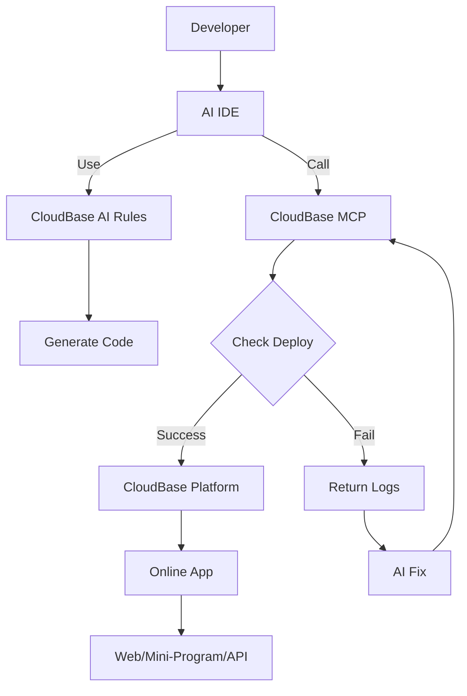

<div align="center">

.png)

# 🌟 CloudBase AI ToolKit

**Smarter, faster development with AI prompts, MCP protocol, and CloudBase.**

**🌍 Languages:** [中文](README.md) | **English**

[](https://opensource.org/licenses/MIT)
[](https://badge.fury.io/js/%40cloudbase%2Fcloudbase-mcp)

[](https://github.com/TencentCloudBase/CloudBase-AI-ToolKit/stargazers)
[](https://github.com/TencentCloudBase/CloudBase-AI-ToolKit/network/members)

[](https://github.com/TencentCloudBase/CloudBase-AI-ToolKit/issues)
[](https://github.com/TencentCloudBase/CloudBase-AI-ToolKit/pulls)
[](https://github.com/TencentCloudBase/CloudBase-AI-ToolKit/commits)
[](https://github.com/TencentCloudBase/CloudBase-AI-ToolKit/graphs/contributors)

Turn your ideas into deployable full-stack applications with just a prompt. Works seamlessly with **Cursor, VSCode GitHub Copilot, WindSurf, CodeBuddy** and other AI IDEs, automatically generating and deploying web apps, mini-programs, and backend services to Tencent CloudBase.

<a href="https://www.producthunt.com/posts/cloudbase-ai-tookit?embed=true&utm_source=badge-featured&utm_medium=badge&utm_source=badge-cloudbase&#0045;ai&#0045;tookit" target="_blank"></a>

### 🚀 Three Core Capabilities

**🤖 AI-Powered Development**: AI auto-generates code and architecture<br>**☁️ Cloud Integration**: One-click access to database, cloud functions, static hosting<br>**⚡ Rapid Deployment**: Full-stack apps online in minutes

### 🛠️ Supported Platforms

**Web Apps**: Modern frontend + static hosting<br>**WeChat Mini-Programs**: Cloud-native mini-program solutions<br>**Backend Services**: Cloud database + serverless functions + cloud hosting

**Full Video Demo**

https://github.com/user-attachments/assets/2b402fa6-c5c4-495a-b85b-f5d4a25daa4a

</div> 

## ✨ Key Features

| Feature | Description | Advantage |
|---------|-------------|-----------|
| **🤖 AI-Native** | Rule library designed for AI programming tools | Code follows CloudBase best practices |
| **🚀 One-Click Deploy** | MCP automated deployment to Tencent CloudBase | Serverless, no server management |
| **📱 Full-Stack Support** | Web + Mini-programs + Database + Backend | Supports various app types, backend hosting, and database |
| **🔧 Smart Debugging** | AI reviews logs and fixes issues | Lower ops cost |
| **⚡ Lightning Fast** | China CDN acceleration | Faster than overseas platforms |
| **📚 Smart Knowledge Base** | Built-in vector search for CloudBase, WeChat Mini-Program docs |

## 🚀 Quick Start

### 0. Prerequisites

#### Install AI Development Tools
Such as [Cursor](https://www.cursor.com/) | [WindSurf](https://windsurf.com/editor) | [CodeBuddy](https://copilot.tencent.com/) etc.

#### Set Up CloudBase Environment and Get Environment ID
1. Visit [Tencent CloudBase Console](https://tcb.cloud.tencent.com/dev) to create an environment. New users can start for free.
2. Get your **Environment ID** from the "Overview" page in the console (needed for deployment)

### 1. Initialize or Enhance Your Project

We provide templates with CloudBase best practices and AI IDE rules. Two recommended ways:

#### 🚀 For New Projects

Choose a template and initialize with one click:

- **React Web App + CloudBase Template**  
  [Download Package](https://static.cloudbase.net/cloudbase-examples/web-cloudbase-react-template.zip?v=2025053001) ｜ [Source Code](https://github.com/TencentCloudBase/awesome-cloudbase-examples/tree/master/web/cloudbase-react-template)

- **WeChat Mini-Program + CloudBase Template**  
  [Download Package](https://static.cloudbase.net/cloudbase-examples/miniprogram-cloudbase-miniprogram-template.zip?v=2025053001) ｜ [Source Code](https://github.com/TencentCloudBase/awesome-cloudbase-examples/tree/master/miniprogram/cloudbase-miniprogram-template)

- **AI Rules Universal CloudBase Template**: Language and framework agnostic, includes CloudBase AI rules and MCP, suitable for any CloudBase project

  [Download Package](https://static.cloudbase.net/cloudbase-examples/web-cloudbase-project.zip) ｜ [Source Code](https://github.com/TencentCloudBase/awesome-cloudbase-examples/tree/master/web/cloudbase-project)

#### 🛠️ Enhance Existing Projects

If you already have a project, after configuring MCP, just tell the AI "Download CloudBase AI rules in the current project" to instantly add and configure AI editor rules in your project directory—no manual steps needed.

### 2. Configure Your AI IDE

> 💡 **Tip:** If you enable auto-run in tools like Cursor, add sensitive commands to the "Command denylist" to avoid accidental execution (e.g., data deletion). By default, manual confirmation is required for safety.

Supported tools:

| Tool | Platform |
|------|----------|
| [Cursor](https://cursor.com/) | Standalone IDE |
| [WindSurf](https://windsurf.com/editor) | Standalone IDE, VSCode, JetBrains plugin |
| [CodeBuddy](https://copilot.tencent.com/) | VS Code, JetBrains, WeChat DevTools plugin |
| [CLINE](https://cline.so/) | VS Code plugin |
| [GitHub Copilot](https://github.com/features/copilot) | VS Code plugin |
| [Trae](https://www.trae.ai/) | Standalone IDE |
| [Tongyi Lingma](https://tongyi.aliyun.com/lingma) | Standalone IDE, VS Code, JetBrains plugin |
| [RooCode](https://roocode.com/) | VS Code plugin |
| [Baidu Comate](https://comate.baidu.com/) | VS Code, JetBrains plugin|

Follow the configuration guide for your tool below. Each tool requires your CloudBase environment ID for MCP features. If you don't have an environment, [create one first](#0-prerequisites).

<details>
<summary><strong>🔧 Cursor Configuration</strong></summary>

#### Step 1: Auto-Apply AI Rules

Templates include `.cursor/rules/` directory, AI will auto-detect CloudBase best practices.

#### Step 2: Configure MCP

Templates include MCP config. If not using a template, click below to install in Cursor:

[](https://cursor.com/install-mcp?name=CloudBase&config=eyJjb21tYW5kIjoibnB4IEBjbG91ZGJhc2UvY2xvdWRiYXNlLW1jcEBsYXRlc3QiLCJlbnYiOnsiQ0xPVURCQVNFX0VOVl9JRCI6IllPVVJfRU5WX0lEIn0sImRpc2FibGVkIjpmYWxzZX0%3D)

1. Edit `.cursor/mcp.json` in your project, set your CloudBase environment ID:

```json
{
  "mcpServers": {
    "cloudbase-mcp": {
      "command": "npx",
      "args": ["-y", "@cloudbase/cloudbase-mcp@latest"],
      "env": {
        "CLOUDBASE_ENV_ID": "your-cloudbase-env-id"
      }
    }
  }
}
```

2. Enable CloudBase MCP Server

Click the ⚙️ icon in Cursor, go to "MCP", find cloudbase and enable it.

#### Step 3: Switch to Agent Mode

Use Agent mode in chat for code generation and automation.

</details>

<details>
<summary><strong>🌊 Codeium/WindSurf Configuration</strong></summary>

#### Step 1: Auto-Apply AI Rules

Templates include `.windsurf/` directory with WindSurf-optimized configurations.

#### Step 2: Configure MCP

Click WindSurf's Plugins icon, click "View raw config", add cloudbase-mcp and set environment ID

```json
{
  "mcpServers": {
    "cloudbase-mcp": {
      "command": "npx",
      "args": ["-y", "@cloudbase/cloudbase-mcp@latest"],
      "env": {
        "CLOUDBASE_ENV_ID": "your-cloudbase-env-id"
      }
    }
  }
}
```

#### Step 3: Switch to Write Mode

Switch to Write mode in chat for intelligent generation.

</details>

<details>
<summary><strong>👥 CodeBuddy Configuration</strong></summary>

#### Step 1: Auto-Apply AI Rules

Templates include `.rules/` directory, CodeBuddy will automatically recognize CloudBase best practices.

#### Step 2: Configure MCP

Click the MCP icon in the top-right corner of CodeBuddy, then click the + button to modify MCP configuration.

Set CLOUDBASE_ENV_ID to your CloudBase environment ID

```json
{
  "mcpServers": {
    "cloudbase-mcp": {
      "command": "npx",
      "args": ["-y", "@cloudbase/cloudbase-mcp@latest"],
      "env": {
        "CLOUDBASE_ENV_ID": "your-cloudbase-env-id"
      }
    }
  }
}
```

#### Step 3: Switch to Craft Agent

Switch to Craft mode in the chat window for intelligent project generation.

Note: In CodeBuddy's Craft mode, disable the confirmation plan feature in the right-side settings for better tool execution.

</details>

<details>
<summary><strong>🤖 CLINE Configuration</strong></summary>

#### Step 1: Auto-Apply AI Rules

Templates include `.clinerules/` directory, AI will automatically recognize CloudBase best practices.

#### Step 2: Configure MCP

Find the MCP Server icon in Cline's panel, click the ⚙️ settings icon, then click Configure MCP Servers

Add the following content, replace CLOUDBASE_ENV_ID with your CloudBase environment ID

```json
{
  "mcpServers": {
    "cloudbase": {
      "autoApprove": [],
      "timeout": 60,
      "command": "npx",
      "args": [
        "@cloudbase/cloudbase-mcp@latest"
      ],
      "env": {
        "CLOUDBASE_ENV_ID": "your-cloudbase-env-id"
      },
      "transportType": "stdio",
      "disabled": false
    }
  }
}
```

#### Step 3: Use AI Chat

Return to the chat interface, recommend using models with good code generation capabilities and function call support.

</details>

<details>
<summary><strong>🐙 GitHub Copilot Configuration</strong></summary>

#### Step 1: Auto-Apply AI Rules

Templates include `.github/` directory with Copilot-optimized configurations.

#### Step 2: Enable CloudBase MCP

Templates include `.vscode/mcp.json` with CloudBase MCP configuration

Modify the environment ID to your CloudBase environment ID

```json
{
    "servers": {
        "cloudbase": {
            "command": "npx",
            "args": [
                "@cloudbase/cloudbase-mcp@latest"
            ],
            "env": {
                "CLOUDBASE_ENV_ID": "your-cloudbase-env-id"
            }
        }
    }
}
```

#### Step 3: Switch to Agent Mode

Switch to Agent mode in the bottom-left corner of the chat window.

</details>

<details>
<summary><strong>🎯 Trae Configuration</strong></summary>

This guide supports both Trae International and Trae CN versions. Recommend using Claude/DeepSeek V3 0324 models for testing.

#### Step 1: Auto-Apply AI Rules

Templates include `.trae/rules` directory with Trae-specific CloudBase rule configurations that AI will auto-apply.

#### Step 2: Enable CloudBase MCP

Click the ⚙️ settings icon in Trae's top-right corner, enter MCP, click manual configuration in settings, and paste the following:

Replace CLOUDBASE_ENV_ID with your CloudBase environment ID

```json
{
  "mcpServers": {
    "cloudbase-mcp": {
      "command": "npx",
      "args": ["-y", "@cloudbase/cloudbase-mcp@latest"], 
      "env": {
        "CLOUDBASE_ENV_ID": "your-cloudbase-env-id"  
      }
    }
  }
}
```

#### Step 3: Use Builder with MCP

Return to chat window, select Builder with MCP in agents.

</details>

<details>
<summary><strong>🧩 Tongyi Lingma Configuration</strong></summary>

#### Step 1: Auto-Apply AI Rules

Templates include `.lingma/` directory, Tongyi Lingma will automatically recognize CloudBase best practices.

#### Step 2: Configure MCP

Click your avatar in Tongyi Lingma's top-right corner, select personal settings, enter MCP settings.

Click the open configuration file button on the right, modify MCP configuration in the opened file.

Set CLOUDBASE_ENV_ID to your CloudBase environment ID

```json
{
  "mcpServers": {
    "cloudbase-mcp": {
      "command": "npx",
      "args": ["-y", "@cloudbase/cloudbase-mcp@latest"],
      "env": {
        "CLOUDBASE_ENV_ID": "your-cloudbase-env-id"
      }
    }
  }
}
```

#### Step 3: Switch to Agent Mode

Switch to agent mode in the bottom-left corner of the chat window.

</details>

### 3. Start Developing

Make sure AI is connected to CloudBase:

```
Query current CloudBase environment info
```

Describe your needs to the AI, e.g.:

```
Build a two-player online Gomoku game, support online battle, then deploy
```

AI will automatically:
- 📝 Generate frontend & backend code
- 🚀 Deploy to CloudBase
- 🔗 Return online access link

If you encounter errors, send the error message to AI for troubleshooting:

```
Error: xxxx
```

You can also ask AI to debug and modify code using cloud function logs:

```
Cloud function code doesn't meet requirements: xxx. Please check logs and data, debug and fix.
```

## 🎯 Use Cases

### Case 1: Two-Player Online Gomoku

**Process:**
1. Input: "Build a two-player online Gomoku game, support online battle"
2. AI generates: Web app + cloud database + real-time data push
3. Auto-deploy and get access link

👉 **Try it:** [Gomoku Game](https://cloud1-5g39elugeec5ba0f-1300855855.tcloudbaseapp.com/gobang/#/)

<details>
<summary>📸 See development screenshots</summary>

| Development | Final Result |
|-------------|-------------|
|  |  |
|  | Supports two-player online battle<br>Real-time board sync |

</details>

### Case 2: AI Pet Mini-Program

**Process:**
1. Input: "Build a pet-raising mini-program, use AI for enhanced interaction"
2. AI generates: Mini-program + cloud database + AI cloud function
3. Import to WeChat DevTools to publish

<details>
<summary>📸 See dev screenshots & preview</summary>

<table>
<tr>
<td width="50%">
<b>🖥️ Dev Screenshots</b><br>

<br>

</td>
<td width="50%">
<b>📱 Mini-Program Preview</b><br>


<br><br>
<b>📲 Experience QR Code</b><br>

</td>
</tr>
</table>

</details>

### Case 3: Smart Issue Diagnosis

When issues occur:
1. AI checks cloud function logs
2. Analyzes errors and generates fix code
3. Auto-redeploys

<details>
<summary>📸 See smart diagnosis process</summary>

<div align="center">

<br>
<i>AI auto-analyzes logs and generates fixes</i>
</div>

</details>

---

## 🌟 Why Choose CloudBase?

- **⚡ Fast Deployment**: China nodes, faster than overseas
- **🛡️ Reliable**: Trusted by 3.3M+ developers
- **🔧 Dev-Friendly**: Full-stack platform for the AI era
- **💰 Cost-Effective**: Serverless, free for new users during development

## 📋 FAQ

For migration, integration, and more, see [FAQ](./FAQ.md).

## 💬 Community

Need help or want to connect? Join our tech community!

### 🔥 WeChat Group

<div align="center">

<br>
<i>Scan to join the WeChat tech group</i>
</div>

**In the group you can:**
- 💡 Share your AI + CloudBase projects
- 🤝 Tech exchange and Q&A
- 📢 Get latest updates and best practices
- 🎯 Join product discussions and suggestions

### 📱 Other Channels

| Platform | Link | Description |
|---------|------|-------------|
| **Docs** | [📖 Docs](https://docs.cloudbase.net/) | Full CloudBase docs |
| **Issue** | [🐛 Submit Issue](https://github.com/TencentCloudBase/CloudBase-AI-ToolKit/issues) | Bug reports & feature requests |

### 🎉 Community Events

- **Weekly Tech Sharing**: Best practices for AI + CloudBase
- **Project Showcases**: Share your AI-powered projects
- **Q&A**: Tencent CloudBase team online support
- **Feature Previews**: Try new features first

## 🛠️ CloudBase MCP Tools Overview

| Tool | Description |
|------|-------------|
| logout | Log out current CloudBase account |
| downloadTemplate | Download CloudBase project templates (React, Mini-Program, AI editor config, etc.) |
| listEnvs | Get all CloudBase environments |
| getEnvAuthDomains | Get valid domain list for environment |
| createEnvDomain | Add safe domain to environment |
| deleteEnvDomain | Remove domain from environment |
| getEnvInfo | Get current environment info |
| updateEnvInfo | Update environment alias |
| createCollection | Create new DB collection |
| checkCollectionExists | Check if DB collection exists |
| updateCollection | Update DB collection config (create/delete index) |
| describeCollection | Get DB collection details |
| listCollections | List DB collections |
| checkIndexExists | Check if index exists |
| distribution | Query data distribution in collection |
| insertDocuments | Insert docs into collection |
| queryDocuments | Query docs in collection |
| updateDocuments | Update docs in collection |
| deleteDocuments | Delete docs in collection |
| uploadFiles | Upload files to static hosting |
| listFiles | List static hosting files |
| deleteFiles | Delete static hosting files/folders |
| findFiles | Search static hosting files |
| createHostingDomain | Bind custom domain |
| deleteHostingDomain | Unbind custom domain |
| getWebsiteConfig | Get static website config |
| tcbCheckResource | Get domain config |
| tcbModifyAttribute | Modify domain config |
| getFunctionList | Get cloud function list |
| createFunction | Create cloud function |
| updateFunctionCode | Update cloud function code |
| updateFunctionConfig | Update cloud function config |
| getFunctionDetail | Get cloud function details |
| invokeFunction | Invoke cloud function |
| getFunctionLogs | Get cloud function logs |
| createFunctionTriggers | Create function trigger |
| deleteFunctionTrigger | Delete function trigger |
| downloadRemoteFile | Download remote file to local temp |
| uploadFile | Upload file to cloud storage (for business data) |
| searchKnowledgeBase | Smart search for CloudBase knowledge base (vector search for docs/answers) |

## 🏗️ Architecture



## 🤝 Contributing

PRs and issues welcome! See our [Contributing Guide](CONTRIBUTING.md) for how to get involved.

## 📄 License

[MIT](LICENSE) © TencentCloudBase

---

⭐ If you find this project helpful, please give us a Star! 