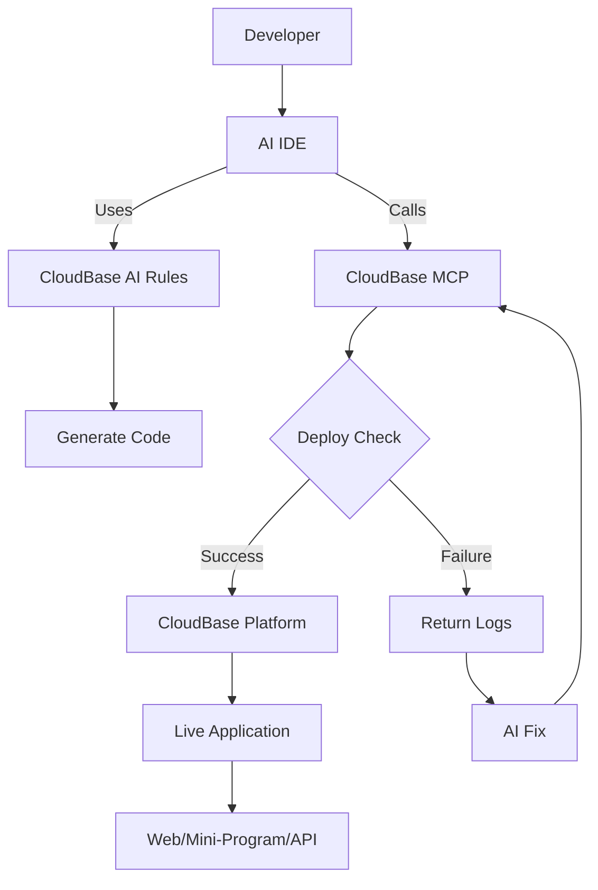

<div align="center">


# 🌟 CloudBase AI ToolKit

**AI-Powered CloudBase: From Prompt to Production**

**🌍 Languages:** [中文](README.md) | **English**

[](https://opensource.org/licenses/MIT)
[](https://badge.fury.io/js/%40cloudbase%2Fcloudbase-mcp)

[](https://github.com/TencentCloudBase/CloudBase-AI-ToolKit/stargazers)
[](https://github.com/TencentCloudBase/CloudBase-AI-ToolKit/network/members)

[](https://github.com/TencentCloudBase/CloudBase-AI-ToolKit/issues)
[](https://github.com/TencentCloudBase/CloudBase-AI-ToolKit/pulls)
[](https://github.com/TencentCloudBase/CloudBase-AI-ToolKit/commits)
[](https://github.com/TencentCloudBase/CloudBase-AI-ToolKit/graphs/contributors)

Turn your ideas into deployable full-stack applications with just a prompt. Works seamlessly with **Cursor, VSCode GitHub Copilot, WindSurf, CodeBuddy** and other AI IDEs, automatically generating and deploying web apps, mini-programs, and backend services to Tencent CloudBase.

<a href="https://www.producthunt.com/posts/cloudbase-ai-tookit?embed=true&utm_source=badge-featured&utm_medium=badge&utm_source=badge-cloudbase&#0045;ai&#0045;tookit" target="_blank"></a>

### 🚀 Three Core Capabilities

**🤖 AI-Native Development**: Automatic code generation and architecture design <br>**☁️ Cloud Integration**: One-click access to database, cloud functions, and static hosting <br>**⚡ Rapid Deployment**: Full-stack applications online in minutes

### 🛠️ Supported Platforms

**Web Applications**: Modern frontend + static hosting<br>**WeChat Mini-Programs**: Cloud-native mini-program solutions<br>**Backend Services**: Cloud database + serverless functions + cloud hosting

**Complete Video Demo**

https://github.com/user-attachments/assets/2b402fa6-c5c4-495a-b85b-f5d4a25daa4a

</div> 

## ✨ Key Features

| Feature | Description | Advantage |
|---------|-------------|-----------|
| **🤖 AI-Native** | Rule library designed for AI programming tools | Generated code follows cloud development best practices |
| **🚀 One-Click Deploy** | MCP automated deployment to Tencent CloudBase platform | Serverless architecture, no server management needed |
| **📱 Full-Stack Support** | Web + Mini-programs + Database + Backend integration | Support for various application types with backend hosting and database |
| **🔧 Smart Debugging** | AI automatically reviews logs and fixes issues | Reduced operational costs |
| **⚡ Lightning Fast** | Domestic CDN acceleration | Faster access than overseas platforms |

## 🚀 Quick Start

### 0. Prerequisites

#### Install AI Development Tools
Such as [Cursor](https://www.cursor.com/) | [WindSurf](https://windsurf.com/editor) | [CodeBuddy](https://copilot.tencent.com/) etc.

#### Set Up CloudBase Environment and Get Environment ID
1. Visit [Tencent CloudBase Console](https://tcb.cloud.tencent.com/dev) to create an environment. New users can start with a free trial.
2. Get your **Environment ID** from the "Overview" page in the console  
   (This ID is required for deployment)

### 1. Create Project with Template

The following templates come with built-in cloud development rules configured for AI IDEs:

Choose the template that fits your project:

- React Web App + CloudBase Template: [Download Package](https://static.cloudbase.net/cloudbase-examples/web-cloudbase-react-template.zip) | [Source Code](https://github.com/TencentCloudBase/awesome-cloudbase-examples/tree/master/web/cloudbase-react-template)
- Mini-Program + CloudBase Template: [Download Package](https://static.cloudbase.net/cloudbase-examples/miniprogram-cloudbase-miniprogram-template.zip) | [Source Code](https://github.com/TencentCloudBase/awesome-cloudbase-examples/tree/master/miniprogram/cloudbase-miniprogram-template)

### 2. Configure Your AI IDE

<details>
<summary><strong>🔧 Cursor Configuration</strong></summary>

#### Step 1: Auto-Apply AI Rules

Templates include `.cursor/rules/` directory, AI will automatically recognize CloudBase best practices.

#### Step 2: Configure MCP

1. Modify `.cursor/mcp.json` in your project with your CloudBase environment ID

```json
{
  "mcpServers": {
    "cloudbase-mcp": {
      "command": "npx",
      "args": ["@cloudbase/cloudbase-mcp@latest"],
      "env": {
        "CLOUDBASE_ENV_ID": "your-cloudbase-env-id"
      }
    }
  }
}
```

2. Enable CloudBase MCP Server

Click the ⚙️ icon in the top-right corner of Cursor, then select "MCP". In the MCP Server page, find the cloudbase toggle button and enable it.

#### Step 3: Switch to Agent Mode

Use Agent mode in the chat window for code generation and automated operations.

</details>

<details>
<summary><strong>🌊 Codeium/WindSurf Configuration</strong></summary>

#### Step 1: Auto-Apply AI Rules

Templates include `.windsurf/` directory with WindSurf-optimized configurations.

#### Step 2: Configure MCP

Click WindSurf's Plugins icon, click "View raw config", add cloudbase-mcp and set environment ID

```json
{
  "mcpServers": {
    "cloudbase-mcp": {
      "command": "npx",
      "args": ["@cloudbase/cloudbase-mcp@latest"],
      "env": {
        "CLOUDBASE_ENV_ID": "your-cloudbase-env-id"
      }
    }
  }
}
```

#### Step 3: Switch to Write Mode

Switch to Write mode in chat for intelligent generation.

</details>

<details>
<summary><strong>👥 CodeBuddy Configuration</strong></summary>

#### Step 1: Auto-Apply AI Rules

Templates include `.rules/` directory, CodeBuddy will automatically recognize CloudBase best practices.

#### Step 2: Configure MCP

Click the MCP icon in the top-right corner of CodeBuddy, then click the + button to modify MCP configuration.

Set CLOUDBASE_ENV_ID to your CloudBase environment ID

```json
{
  "mcpServers": {
    "cloudbase-mcp": {
      "command": "npx",
      "args": ["@cloudbase/cloudbase-mcp@latest"],
      "env": {
        "CLOUDBASE_ENV_ID": "your-cloudbase-env-id"
      }
    }
  }
}
```

#### Step 3: Switch to Craft Agent

Switch to Craft mode in the chat window for intelligent project generation.

Note: In CodeBuddy's Craft mode, disable the confirmation plan feature in the right-side settings for better tool execution.

</details>

<details>
<summary><strong>🤖 CLINE Configuration</strong></summary>

#### Step 1: Auto-Apply AI Rules

Templates include `.clinerules/` directory, AI will automatically recognize CloudBase best practices.

#### Step 2: Configure MCP

Find the MCP Server icon in Cline's panel, click the ⚙️ settings icon, then click Configure MCP Servers

Add the following content, replace CLOUDBASE_ENV_ID with your CloudBase environment ID

```json
{
  "mcpServers": {
    "cloudbase": {
      "autoApprove": [],
      "timeout": 60,
      "command": "npx",
      "args": [
        "@cloudbase/cloudbase-mcp@latest"
      ],
      "env": {
        "CLOUDBASE_ENV_ID": "your-cloudbase-env-id"
      },
      "transportType": "stdio",
      "disabled": false
    }
  }
}
```

#### Step 3: Use AI Chat

Return to the chat interface, recommend using models with good code generation capabilities and function call support.

</details>

<details>
<summary><strong>🐙 GitHub Copilot Configuration</strong></summary>

#### Step 1: Auto-Apply AI Rules

Templates include `.github/` directory with Copilot-optimized configurations.

#### Step 2: Enable CloudBase MCP

Templates include `.vscode/mcp.json` with CloudBase MCP configuration

Modify the environment ID to your CloudBase environment ID

```json
{
    "servers": {
        "cloudbase": {
            "command": "npx",
            "args": [
                "@cloudbase/cloudbase-mcp@latest"
            ],
            "env": {
                "CLOUDBASE_ENV_ID": "your-cloudbase-env-id"
            }
        }
    }
}
```

#### Step 3: Switch to Agent Mode

Switch to Agent mode in the bottom-left corner of the chat window.

</details>

<details>
<summary><strong>🎯 Trae Configuration</strong></summary>

This guide supports both Trae International and Trae CN versions. Recommend using Claude/DeepSeek V3 0324 models for testing.

#### Step 1: Auto-Apply AI Rules

Templates include `.trae/rules` directory with Trae-specific CloudBase rule configurations that AI will auto-apply.

#### Step 2: Enable CloudBase MCP

Click the ⚙️ settings icon in Trae's top-right corner, enter MCP, click manual configuration in settings, and paste the following:

Replace CLOUDBASE_ENV_ID with your CloudBase environment ID

```json
{
  "mcpServers": {
    "cloudbase-mcp": {
      "command": "npx",
      "args": ["@cloudbase/cloudbase-mcp@latest"], 
      "env": {
        "CLOUDBASE_ENV_ID": "your-cloudbase-env-id"  
      }
    }
  }
}
```

#### Step 3: Use Builder with MCP

Return to chat window, select Builder with MCP in agents.

</details>

<details>
<summary><strong>🧩 Tongyi Lingma Configuration</strong></summary>

#### Step 1: Auto-Apply AI Rules

Templates include `.lingma/` directory, Tongyi Lingma will automatically recognize CloudBase best practices.

#### Step 2: Configure MCP

Click your avatar in Tongyi Lingma's top-right corner, select personal settings, enter MCP settings.

Click the open configuration file button on the right, modify MCP configuration in the opened file.

Set CLOUDBASE_ENV_ID to your CloudBase environment ID

```json
{
  "mcpServers": {
    "cloudbase-mcp": {
      "command": "npx",
      "args": ["@cloudbase/cloudbase-mcp@latest"],
      "env": {
        "CLOUDBASE_ENV_ID": "your-cloudbase-env-id"
      }
    }
  }
}
```

#### Step 3: Switch to Agent Mode

Switch to agent mode in the bottom-left corner of the chat window.

</details>

### 3. Start Development

Confirm AI is connected to CloudBase:

```
Query current CloudBase environment information
```

Describe your requirements to AI for development:

```
Create a real-time multiplayer Gomoku game website with online battles, then deploy it
```

AI will automatically:
- 📝 Generate frontend and backend code  
- 🚀 Deploy to CloudBase
- 🔗 Return online access link

If you encounter errors during development, share the error message with AI for troubleshooting:

```
Got an error: xxxx
```

You can also have AI debug and modify code using cloud function logs:

```
Cloud function code doesn't meet requirements, requirement is xxx, please check logs and data for debugging and fixes
```

## 🎯 Use Cases

### Case 1: Real-time Multiplayer Gomoku

**Development Process:**
1. Input requirement: "Create a real-time multiplayer Gomoku website with online battles"
2. AI generates: Web app + cloud database + real-time data push
3. Automatically deploys and provides access link

👉 **Live Demo:** [Gomoku Game](https://cloud1-5g39elugeec5ba0f-1300855855.tcloudbaseapp.com/gobang/#/)

<details>
<summary>📸 View Development Screenshots</summary>

| Development Process | Final Result |
|---------------------|--------------|
|  |  |
|  | Supports real-time multiplayer battles<br>Real-time game synchronization |

</details>

### Case 2: AI Pet Care Mini-Program

**Development Process:**
1. Input: "Develop a pet care mini-program with AI-enhanced interactions"
2. AI generates: Mini-program + cloud database + AI cloud functions
3. Import into WeChat Developer Tools for publishing

<details>
<summary>📸 View Development Screenshots & Mini-Program Preview</summary>

<table>
<tr>
<td width="50%">
<b>🖥️ Development Screenshots</b><br>

<br>

</td>
<td width="50%">
<b>📱 Mini-Program Preview</b><br>


<br><br>
<b>📲 Try QR Code</b><br>

</td>
</tr>
</table>

</details>

### Case 3: Intelligent Issue Diagnosis

When applications have problems:
1. AI automatically reviews cloud function logs
2. Analyzes error causes and generates fix code  
3. Automatically redeploys

<details>
<summary>📸 View Intelligent Diagnosis Process</summary>

<div align="center">

<br>
<i>AI automatically analyzes logs and generates fix solutions</i>
</div>

</details>

---

## 🛠️ CloudBase MCP Tools Overview

| Tool Name | Description |
|-----------|-------------|
| logout | Log out of current CloudBase account |
| listEnvs | Get all CloudBase environment information |
| getEnvAuthDomains | Get authorized domain list for CloudBase environment |
| createEnvDomain | Add security domain for CloudBase environment |
| deleteEnvDomain | Delete specified security domain for CloudBase environment |
| getEnvInfo | Get current CloudBase environment information |
| updateEnvInfo | Modify CloudBase environment alias |
| createCollection | Create a new CloudBase database collection |
| checkCollectionExists | Check if CloudBase database collection exists |
| updateCollection | Update CloudBase database collection configuration (create or delete indexes) |
| describeCollection | Get detailed information of CloudBase database collection |
| listCollections | Get CloudBase database collection list |
| checkIndexExists | Check if index exists |
| distribution | Query data distribution in database collections |
| insertDocuments | Insert documents into collection |
| queryDocuments | Query documents in collection |
| updateDocuments | Update documents in collection |
| deleteDocuments | Delete documents in collection |
| uploadFiles | Upload files to static website hosting |
| listFiles | Get file list from static website hosting |
| deleteFiles | Delete files or folders from static website hosting |
| findFiles | Search files in static website hosting |
| createHostingDomain | Bind custom domain |
| deleteHostingDomain | Unbind custom domain |
| getWebsiteConfig | Get static website configuration |
| tcbCheckResource | Get domain configuration |
| tcbModifyAttribute | Modify domain configuration |
| getFunctionList | Get cloud function list |
| createFunction | Create cloud function |
| updateFunctionCode | Update cloud function code |
| updateFunctionConfig | Update cloud function configuration |
| getFunctionDetail | Get cloud function details |
| invokeFunction | Invoke cloud function |
| getFunctionLogs | Get cloud function logs |
| createFunctionTriggers | Create cloud function triggers |
| deleteFunctionTrigger | Delete cloud function trigger |
| downloadRemoteFile | Download remote file to local temporary file |
| uploadFile | Upload file to cloud storage (for business data files) |

## 🏗️ Architecture Overview



## 🌟 Why Choose CloudBase?

- **⚡ Lightning Deployment**: Domestic nodes, faster access than overseas platforms
- **🛡️ Stable & Reliable**: Serverless platform chosen by 3.3M+ developers
- **🔧 Developer-Friendly**: Full-stack platform designed for the AI era
- **💰 Cost-Optimized**: Serverless architecture with better elasticity, free trial for new users during development

## 💬 Community

Having issues or want to share experiences? Join our tech community!

### 🔥 WeChat Group

<div align="center">

<br>
<i>Scan to join WeChat tech community</i>
</div>

**In the group you can:**
- 💡 Share your AI + CloudBase projects
- 🤝 Technical discussions and development Q&A
- 📢 Get latest feature updates and best practices
- 🎯 Participate in product feature discussions and suggestions

### 📱 Other Communication Channels

| Platform | Link | Description |
|----------|------|-------------|
| **Official Docs** | [📖 View Docs](https://docs.cloudbase.net/) | Complete CloudBase documentation |
| **Issue Feedback** | [🐛 Submit Issues](https://github.com/TencentCloudBase/CloudBase-AI-ToolKit/issues) | Bug reports and feature requests |

### 🎉 Community Activities

- **Weekly Tech Sharing**: Regular sharing of AI + CloudBase best practices
- **Project Showcase**: Show off your AI-built projects
- **Q&A Sessions**: Tencent CloudBase team members provide online support
- **Feature Previews**: First access to new features

## 🤝 Contributing

Welcome to submit Issues and Pull Requests! Please check our [Contributing Guide](CONTRIBUTING.md) to learn how to participate in project development.

## 📄 License

[MIT](LICENSE) © TencentCloudBase

---

⭐ If this project helps you, please give us a Star! 

## 📋 [FAQ](./FAQ.md)

For common questions about migration, integration, etc., please check [FAQ](./FAQ.md). 