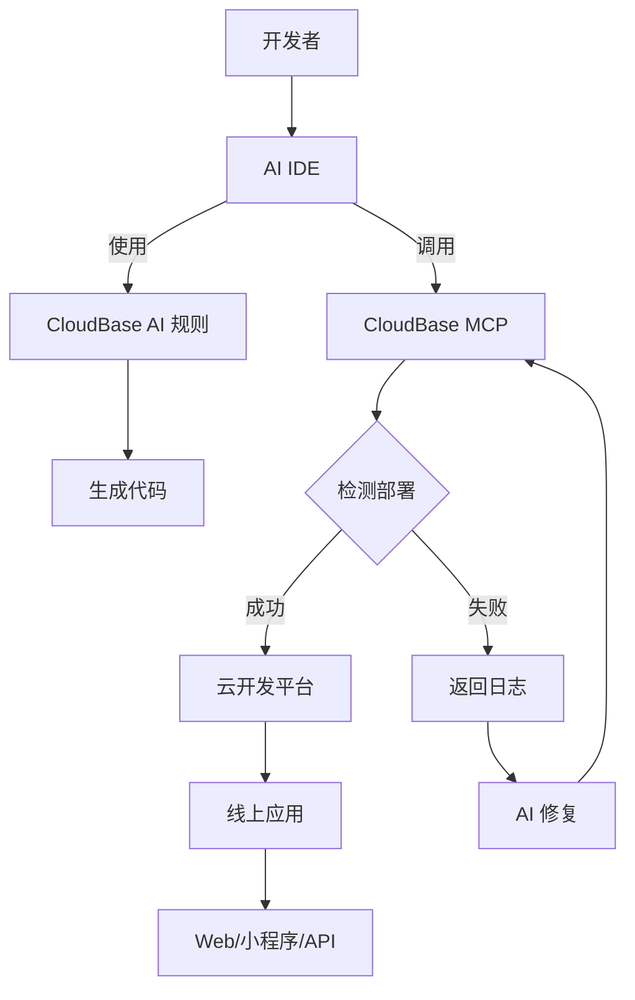

<div align="center">


# 🌟 CloudBase AI ToolKit

**🪐 用 AI IDE 一键生成、部署和托管你的全栈 Web 应用与小程序、数据库和后端服务，无需运维，极速上线你的创意 💫**

**🌍 Languages:** [English](README.md) | **中文**


[](https://opensource.org/licenses/MIT)
[](https://www.npmjs.com/package/@cloudbase/cloudbase-mcp)
[](https://www.npmjs.com/package/@cloudbase/cloudbase-mcp)
[](https://github.com/TencentCloudBase/CloudBase-AI-ToolKit/stargazers)
[](https://github.com/TencentCloudBase/CloudBase-AI-ToolKit/network/members)

[](https://github.com/TencentCloudBase/CloudBase-AI-ToolKit/issues)
[](https://github.com/TencentCloudBase/CloudBase-AI-ToolKit/pulls)
[](https://github.com/TencentCloudBase/CloudBase-AI-ToolKit/commits)
[](https://github.com/TencentCloudBase/CloudBase-AI-ToolKit/graphs/contributors)
[](https://cnb.cool/tencent/cloud/cloudbase/CloudBase-AI-ToolKit)
[](https://deepwiki.com/TencentCloudBase/CloudBase-AI-ToolKit)

当你在**Cursor/ VSCode GitHub Copilot/WinSurf/CodeBuddy/Augment Code/Claude Code/OpenAI Codex CLI**等AI编程工具里写代码时，它能自动帮你生成可直接部署的前后端应用+小程序，并一键发布到腾讯云开发 CloudBase。


**📹 完整视频演示 ⬇️**

<a href="https://www.bilibili.com/video/BV1hpjvzGESg/" target="_blank">
  
</a>

| 🚀 **核心能力** | 🛠️ **支持平台** |
|---|---|
| 🤖 **AI智能开发**: AI自动生成代码和架构设计<br>☁️ **云开发集成**: 一键接入数据库、云函数、静态托管<br>⚡ **快速部署**: 几分钟内完成全栈应用上线 | **Web应用**: 现代化前端 + 静态托管<br>**微信小程序**: 云开发小程序解决方案<br>**后端服务**: 云数据库 + 无服务器函数+云托管 |

📚 [快速开始](https://docs.cloudbase.net/ai/cloudbase-ai-toolkit/getting-started) | 🛠️ [IDE配置](https://docs.cloudbase.net/ai/cloudbase-ai-toolkit/ide-setup/) | 🎨 [项目模板](https://docs.cloudbase.net/ai/cloudbase-ai-toolkit/templates) | 📖 [开发指南](https://docs.cloudbase.net/ai/cloudbase-ai-toolkit/development) | 🎮 [使用案例](https://docs.cloudbase.net/ai/cloudbase-ai-toolkit/examples) | 🎓 [教程](https://docs.cloudbase.net/ai/cloudbase-ai-toolkit/tutorials) | 🔌 [插件系统](https://docs.cloudbase.net/ai/cloudbase-ai-toolkit/plugins) | 🔧 [MCP工具](https://docs.cloudbase.net/ai/cloudbase-ai-toolkit/mcp-tools) | ❓ [常见问题](https://docs.cloudbase.net/ai/cloudbase-ai-toolkit/faq)


</div> 

## ✨ 核心特性

- **🤖 AI 原生** - 专为 AI 编程工具设计的规则库，生成代码符合云开发最佳实践
- **🚀 一键部署** - MCP 自动化部署到腾讯云开发 CloudBase 平台，Serverless 架构无需购买服务器
- **📱 全栈应用** - Web + 小程序 + 数据库 + 后端一体化，支持多种应用形式和后端托管
- **🔧 智能修复** - AI 自动查看日志并修复问题，降低运维成本
- **⚡ 极速体验** - 国内 CDN 加速，比海外平台访问速度更快
- **📚 知识检索** - 内置云开发、微信小程序等专业知识库的智能向量检索

- **🎯 灵活工作流** - 支持 /spec 和 /no_spec 命令，根据任务复杂度智能选择开发模式

> [!TIP]
> 
> 🚩内置支持 Spec 工作流：让 AI 编程更工程化
> 
> - 内置 Kiro 风格 Spec 工作流，支持 Cursor、Claude Code 等主流 AI IDE
> - 需求、设计、任务分明，自动生成 requirements.md、design.md、tasks.md
> - 摆脱“拉霸式” vibe coding，开发过程可控、可追溯
> - 让 AI 协助梳理需求、设计方案、拆分任务，人类专注决策与评审
- **Spec 工作流已内置在云开发 AI 规则中**，下载最新模板或让 AI 在当前项目下载云开发 AI 规则即可获取

---
🚩 **快速上手 CloudBase AI ToolKit**

1. **启用 CloudBase 工具（MCP 配置）**  
在你的 AI IDE（如 Cursor）中添加以下配置，即可启用 CloudBase AI ToolKit 的全部能力：

```json
{
  "mcpServers": {
    "cloudbase": {
      "command": "npx",
      "args": ["npm-global-exec@latest", "@cloudbase/cloudbase-mcp@latest"]
    }
  }
}
```

2. **一键生成项目模板**  
在 AI 对话框输入：

```
下载小程序云开发模板
```

如果你只想下载特定IDE的配置文件，避免项目文件混乱，可以指定IDE类型：
```
下载小程序云开发模板，只包含Cursor配置
下载React云开发模板，只包含WindSurf配置
下载通用云开发模板，只包含Claude Code配置
```

支持的IDE类型：cursor、windsurf、codebuddy、claude-code、cline、gemini-cli、opencode、qwen-code、baidu-comate、openai-codex-cli、augment-code、github-copilot、roocode、tongyi-lingma、trae、vscode

3. **可选模板类型**  
- 小程序云开发模板
- React 云开发模板
- Vue 云开发模板
- UniApp 云开发模板
- 通用云开发模板

👉 [查看全部官方模板及说明](https://docs.cloudbase.net/ai/cloudbase-ai-toolkit/templates)

4. **详细教程**  
👉 [查看完整配置与使用教程](#2-配置你的-ai-ide)

---

## 🚀 快速开始


### 0. 前置条件

<details>
<summary>安装 AI 开发工具</summary>

例如 [Cursor](https://www.cursor.com/) | [WindSurf](https://windsurf.com/editor) | [CodeBuddy](https://copilot.tencent.com/) 等，点击查看 [支持的 AI 开发工具列表](#2-配置你的-ai-ide)

</details>

<details>
<summary>开通云开发环境</summary>

访问 [腾讯云开发控制台](https://tcb.cloud.tencent.com/dev)开通环境，新用户可以免费开通体验。

</details>

<details>
<summary>安装 Node.js v18.15.0及以上版本</summary>

确保您的计算机上安装了 Node.js v18.15.0 及以上版本。您可以从 [Node.js 官网](https://nodejs.org/) 下载并安装最新版本。

</details>

<details>
<summary>可选：设置 npm 源</summary>

为了提高依赖包的下载速度，建议将 npm 源设置为腾讯镜像源。您可以在**终端命令行**中运行以下命令：

```bash
npm config set registry https://mirrors.cloud.tencent.com/npm/
```

这样可以加快依赖包的下载速度，特别是在中国大陆地区。
</details>

<details>
<summary>可选：清理 npx 缓存</summary>
由于 npx 这个工具本身存在一个缓存的 bug，可能导致 CloudBase AI ToolKit 安装问题，您可以尝试清理 npx 缓存。

在**终端命令行**中运行以下命令：
```
npx clear-npx-cache
```
</details>

### 1. 快速初始化或增强你的项目

我们为你准备了内置云开发最佳实践和 AI IDE 规则的项目模板，推荐如下两种方式：

#### 🚀 新项目推荐

选择适合你的模板，一键初始化：

- **微信小程序 + 云开发模板**  
  [下载代码包](https://static.cloudbase.net/cloudbase-examples/miniprogram-cloudbase-miniprogram-template.zip?v=2025053001) ｜ [开源代码地址](https://github.com/TencentCloudBase/awesome-cloudbase-examples/tree/master/miniprogram/cloudbase-miniprogram-template)

- **React Web 应用 + 云开发模板**  
  [下载代码包](https://static.cloudbase.net/cloudbase-examples/web-cloudbase-react-template.zip?v=2025053001) ｜ [开源代码地址](https://github.com/TencentCloudBase/awesome-cloudbase-examples/tree/master/web/cloudbase-react-template)

- **Vue Web 应用 + 云开发模板**  
  [下载代码包](https://static.cloudbase.net/cloudbase-examples/web-cloudbase-vue-template.zip?v=2025053001) ｜ [开源代码地址](https://github.com/TencentCloudBase/awesome-cloudbase-examples/tree/master/web/cloudbase-vue-template)

- **UniApp 跨端应用 + 云开发模板**  
  [下载代码包](https://static.cloudbase.net/cloudbase-examples/universal-cloudbase-uniapp-template.zip?v=2025053001) ｜ [开源代码地址](https://github.com/TencentCloudBase/awesome-cloudbase-examples/tree/master/universal/cloudbase-uniapp-template)

- **AI 规则通用云开发模板** ：不限定语言和框架，内置 CloudBase AI 规则和MCP，适用于任意云开发项目

  [下载代码包](https://static.cloudbase.net/cloudbase-examples/web-cloudbase-project.zip) ｜ [开源代码地址](https://github.com/TencentCloudBase/awesome-cloudbase-examples/tree/master/web/cloudbase-project)

#### 🛠️ 已有项目增强

如果你已经有自己的项目，只需在配置好 MCP 后，只需要对 AI 说 "在当前项目中下载云开发 AI 规则"，即可一键下载并补全 AI 编辑器规则配置到当前项目目录，无需手动操作。

如果你只想下载特定IDE的配置文件，避免项目文件混乱，可以指定IDE类型：
```
在当前项目中下载云开发 AI 规则，只包含Cursor配置
在当前项目中下载云开发 AI 规则，只包含WindSurf配置
在当前项目中下载云开发 AI 规则，只包含Claude Code配置
```


### 2. 配置你的 AI IDE

> [!TIP]
> 温馨提示：如果你使用的是模板项目，所有配置都已经预置完成,请按照指引进行检查和开启工具。如果不是从模板开始，需要按具体的说明手动添加相应配置：

以下工具均支持 CloudBase AI ToolKit，选择合适的工具并按说明配置：


| 工具 | 支持平台 | 查看指引 |
|------|----------|----------|
| [Cursor](https://docs.cloudbase.net/ai/cloudbase-ai-toolkit/ide-setup/cursor) | 独立 IDE| [查看指引](https://docs.cloudbase.net/ai/cloudbase-ai-toolkit/ide-setup/cursor) |
| [WindSurf](https://docs.cloudbase.net/ai/cloudbase-ai-toolkit/ide-setup/windsurf) | 独立 IDE, VSCode、JetBrains 插件 | [查看指引](https://docs.cloudbase.net/ai/cloudbase-ai-toolkit/ide-setup/windsurf) |
| [CodeBuddy](https://docs.cloudbase.net/ai/cloudbase-ai-toolkit/ide-setup/codebuddy) | 独立 IDE（已内置 CloudBase），VS Code、JetBrains、微信开发者工具| [查看指引](https://docs.cloudbase.net/ai/cloudbase-ai-toolkit/ide-setup/codebuddy) |
| [CLINE](https://docs.cloudbase.net/ai/cloudbase-ai-toolkit/ide-setup/cline) | VS Code 插件 | [查看指引](https://docs.cloudbase.net/ai/cloudbase-ai-toolkit/ide-setup/cline) |
| [GitHub Copilot](https://docs.cloudbase.net/ai/cloudbase-ai-toolkit/ide-setup/github-copilot) | VS Code 插件 | [查看指引](https://docs.cloudbase.net/ai/cloudbase-ai-toolkit/ide-setup/github-copilot) |
| [Trae](https://docs.cloudbase.net/ai/cloudbase-ai-toolkit/ide-setup/trae) | 独立 IDE | [查看指引](https://docs.cloudbase.net/ai/cloudbase-ai-toolkit/ide-setup/trae) |
| [通义灵码](https://docs.cloudbase.net/ai/cloudbase-ai-toolkit/ide-setup/tongyi-lingma) | 独立 IDE，VS Code、 JetBrains插件 | [查看指引](https://docs.cloudbase.net/ai/cloudbase-ai-toolkit/ide-setup/tongyi-lingma) |
| [RooCode](https://docs.cloudbase.net/ai/cloudbase-ai-toolkit/ide-setup/roocode) | VS Code插件 | [查看指引](https://docs.cloudbase.net/ai/cloudbase-ai-toolkit/ide-setup/roocode) |
| [文心快码](https://docs.cloudbase.net/ai/cloudbase-ai-toolkit/ide-setup/baidu-comate) | VS Code、JetBrains插件| [查看指引](https://docs.cloudbase.net/ai/cloudbase-ai-toolkit/ide-setup/baidu-comate) |
| [Augment Code](https://docs.cloudbase.net/ai/cloudbase-ai-toolkit/ide-setup/augment-code) | VS Code、JetBrains 插件 | [查看指引](https://docs.cloudbase.net/ai/cloudbase-ai-toolkit/ide-setup/augment-code) |
| [Claude Code](https://docs.cloudbase.net/ai/cloudbase-ai-toolkit/ide-setup/claude-code) | 命令行工具 | [查看指引](https://docs.cloudbase.net/ai/cloudbase-ai-toolkit/ide-setup/claude-code) |
| [Gemini CLI](https://docs.cloudbase.net/ai/cloudbase-ai-toolkit/ide-setup/gemini-cli) | 命令行工具 | [查看指引](https://docs.cloudbase.net/ai/cloudbase-ai-toolkit/ide-setup/gemini-cli) |
| [OpenAI Codex CLI](https://docs.cloudbase.net/ai/cloudbase-ai-toolkit/ide-setup/openai-codex-cli) | 命令行工具 | [查看指引](https://docs.cloudbase.net/ai/cloudbase-ai-toolkit/ide-setup/openai-codex-cli) |
| [OpenCode](https://docs.cloudbase.net/ai/cloudbase-ai-toolkit/ide-setup/opencode) | 命令行工具 | [查看指引](https://docs.cloudbase.net/ai/cloudbase-ai-toolkit/ide-setup/opencode) |
| [Qwen Code](https://docs.cloudbase.net/ai/cloudbase-ai-toolkit/ide-setup/qwen-code) | 命令行工具 | [查看指引](https://docs.cloudbase.net/ai/cloudbase-ai-toolkit/ide-setup/qwen-code) |


### 3. 开始开发


在开始使用前，只需要对 AI 说

```
登录云开发
```
AI 就会自动完成弹出登录腾讯云界面以及云开发的环境选择

后续如需切换环境，可以说

```
退出云开发
```

AI 就会清理本地的配置，后续可以再要求 AI 登录云开发来重新登录。

在登录成功后，可以确认 AI 已经连接到云开发

```
查询当前云开发环境信息
```

向 AI 描述你的需求,进行开发：

```
做一个双人在线对战五子棋网站，支持联机对战，最后进行部署
```

AI 会自动：
- 📝 生成前后端代码  
- 🚀 部署到云开发
- 🔗 返回在线访问链接

开发过程中如果遇到报错，可以把错误信息发给 AI 来进行排障

```
报错了，错误是xxxx
```


也可以让 AI 结合云函数日志进行调试和修改代码

```
云函数代码运行不符合需求，需求是 xxx，请查看日志和数据进行调试，并进行修复
```

## 🔌 插件系统

CloudBase MCP 采用插件化架构，支持按需启用工具模块。[查看详细文档](https://docs.cloudbase.net/ai/cloudbase-ai-toolkit/plugins)

### 快速配置

```json
{
  "env": {
    "CLOUDBASE_MCP_PLUGINS_ENABLED": "env,database,functions,hosting"
  }
}
```


## 📚 教程

### 📄 文章

#### 🌐 全栈Web应用
- [使用 CodeBuddy IDE + CloudBase 一站式开发卡片翻翻翻游戏](https://mp.weixin.qq.com/s/2EM3RBzdQUCdfld2CglWgg)
- [1小时开发微信小游戏《我的早餐店》——基于CloudBase AI Toolkit](https://cloud.tencent.com/developer/article/2532595)
- [AI Coding宝藏组合：Cursor + Cloudbase-AI-Toolkit 开发游戏实战](https://juejin.cn/post/7518783423277695028#comment)
- [2天上线一款可联机的分手厨房小游戏](https://mp.weixin.qq.com/s/nKfhHUf8w-EVKvA0u1rdeg)
- [CloudBase AI Toolkit 做一个医院实习生排班系统，告别痛苦的excel表格](https://cloud.tencent.com/developer/article/2538023)
- [没有服务器，怎么云化部署前后端项目](https://cloud.tencent.com/developer/article/2537971)
- [快速打造程序员专属名片网站](https://cloud.tencent.com/developer/article/2536273)

#### 📱 全栈小程序
- [我用「CloudBase AI ToolKit」一天做出"网络热词"小程序](https://cloud.tencent.com/developer/article/2537907)
- [用AI打造你的专属"云书房"小程序！](https://cloud.tencent.com/developer/article/2535789)
- [一人挑战全栈研发简历制作小程序](https://cloud.tencent.com/developer/article/2535894)
- [我用AI开发并上线了一款小程序：解忧百宝盒](https://mp.weixin.qq.com/s/DYekRheNQ2u8LAl_F830fA)
- [AI时代，从零基础到全栈开发者之路：Figma + Cursor + Cloudbase快速搭建微信小程序](https://mp.weixin.qq.com/s/nT2JsKnwBiup1imniCr2jA)

### 📱 应用项目
- [简历助手小程序](https://gitcode.com/qq_33681891/resume_template)
- [五子棋联机游戏](https://github.com/TencentCloudBase/awesome-cloudbase-examples/tree/master/web/gomoku-game)
- [分手厨房联机游戏](https://github.com/TencentCloudBase/awesome-cloudbase-examples/tree/master/web/overcooked-game)
- [电商管理后台](https://github.com/TencentCloudBase/awesome-cloudbase-examples/tree/master/web/ecommerce-management-backend)
- [短视频小程序](https://github.com/TencentCloudBase/awesome-cloudbase-examples/tree/master/miniprogram/cloudbase-ai-video)
- [约会小程序](https://github.com/TencentCloudBase/awesome-cloudbase-examples/tree/master/miniprogram/dating)

### 🎥 视频教程
- [云开发CloudBase：用AI开发一款分手厨房小游戏](https://www.bilibili.com/video/BV1v5KAzwEf9/)
- [软件3.0：AI 编程新时代的最佳拍档 CloudBase AI ToolKit，以开发微信小程序为例](https://www.bilibili.com/video/BV15gKdz1E5N/)
- [用AiCoding 一人挑战全栈研发简历制作小程序](https://www.bilibili.com/video/BV1D23Nz1Ec3/)
- [5分钟在本地创造一个程序员专属名片网站](https://www.bilibili.com/video/BV19y3EzsEHQ/?vd_source=c8763f6ab9c7c6f7f760ad7ea9157011)

---

## 🎯 使用案例

### 案例1：双人在线对战五子棋

**开发过程：**
1. 输入需求："做个双人在线对战五子棋网站，支持联机对战"
2. AI 生成：Web 应用 + 云数据库 + 实时数据推送
3. 自动部署并获得访问链接

👉 **体验地址：** [五子棋游戏](https://cloud1-5g39elugeec5ba0f-1300855855.tcloudbaseapp.com/gobang/#/)

<details>
<summary>📸 查看开发截图</summary>

| 开发过程 | 最终效果 |
|---------|---------|
|  |  |
|  | 支持双人在线对战<br>实时棋局同步 |

</details>

### 案例2：AI 宠物养成小程序

**开发过程：**
1. 输入："开发一个宠物小精灵养成小程序，使用 AI 增强互动"
2. AI 生成：小程序 + 云数据库 + AI 云函数
3. 导入微信开发者工具即可发布

<details>
<summary>📸 查看开发截图与小程序预览</summary>

<table>
<tr>
<td width="50%">
<b>🖥️ 开发截图</b><br>

<br>

</td>
<td width="50%">
<b>📱 小程序预览</b><br>


<br><br>
<b>📲 体验二维码</b><br>

</td>
</tr>
</table>

</details>

### 案例3：智能问题诊断

当应用出现问题时：
1. AI 自动查看云函数日志
2. 分析错误原因并生成修复代码  
3. 自动重新部署

<details>
<summary>📸 查看智能诊断过程</summary>

<div align="center">

<br>
<i>AI 自动分析日志并生成修复方案</i>
</div>

</details>

---

## 🌟 为什么选择 CloudBase？

- **⚡ 极速部署**：国内节点,访问速度比海外更快
- **🛡️ 稳定可靠**：330 万开发者选择的 Serverless 平台
- **🔧 开发友好**：专为AI时代设计的全栈平台，支持自动环境配置
- **💰 成本优化**：Serverless 架构更具弹性，新用户开发期间可以免费体验


## 📋 常见问题 FAQ

如有迁移、集成等常见疑问，请查阅 [FAQ 常见问题](https://docs.cloudbase.net/ai/cloudbase-ai-toolkit/faq)。 

## 💬 技术交流群

遇到问题或想要交流经验？加入我们的技术社区！

### 🔥 微信交流群

<div align="center">

<br>
<i>扫码加入微信技术交流群</i>
</div>

**群内你可以：**
- 💡 分享你的 AI + 云开发项目
- 🤝 技术交流和开发问题沟通
- 📢 获取最新功能更新和最佳实践
- 🎯 参与产品功能讨论和建议

### 📱 其他交流方式

| 平台 | 链接 | 说明 |
|------|------|------|
| **官方文档** | [📖 查看文档](https://docs.cloudbase.net/) | 完整的云开发文档 |
| **Issue 反馈** | [🐛 提交问题](https://github.com/TencentCloudBase/CloudBase-AI-ToolKit/issues) | Bug 反馈和功能请求 |

### 🎉 社区活动

- **每周技术分享**：群内定期分享 AI + 云开发最佳实践
- **项目展示**：展示你用 AI 开发的精彩项目
- **问题答疑**：腾讯云开发团队成员在线答疑
- **新功能预览**：第一时间体验最新功能


## 🛠️ 云开发 MCP 工具一览

目前共有 **39 个工具**，涵盖环境管理、数据库操作、云函数管理、静态托管、小程序发布等核心功能。

📋 **完整工具文档**: [查看 MCP 工具详细说明](doc/mcp-tools.md) | [查看工具规格 JSON](scripts/tools.json)

### 🔧 工具分类概览

| 分类 | 工具数量 | 主要功能 |
|------|----------|----------|
| 🌍 **环境管理** | 4 个 | 登录认证、环境信息查询、域名管理 |
| 🗄️ **数据库操作** | 11 个 | 集合管理、文档 CRUD、索引操作、数据模型 |
| ⚡ **云函数管理** | 9 个 | 函数创建、更新、调用、日志、触发器 |
| 🌐 **静态托管** | 5 个 | 文件上传管理、域名配置、网站部署 |
| 📁 **文件操作** | 2 个 | 远程文件下载、云存储上传 |
| 📱 **小程序发布** | 7 个 | 小程序上传、预览、构建、配置、调试、质量检查 |
| 🛠️ **工具支持** | 4 个 | 项目模板、知识库搜索、联网搜索、交互对话 |
| 🔌 **HTTP访问** | 1 个 | HTTP 函数访问配置 |

### 🌟 核心工具亮点

| 工具类型 | 工具名称 | 功能亮点 |
|----------|----------|----------|
| 🔐 **身份认证** | `login` / `logout` | 一键登录云开发，自动环境选择 |
| 📊 **环境查询** | `envQuery` | **🔄 合并工具** - 环境列表、信息、域名一体化查询 |
| 🗄️ **数据库** | `collectionQuery` | **🔄 合并工具** - 集合存在性、详情、列表统一管理 |
| ⚡ **云函数** | `createFunction` | 支持完整配置、自动依赖安装、触发器设置 |
| 🌐 **静态托管** | `uploadFiles` | 批量文件上传、智能忽略规则、CDN 加速 |
| 🧠 **AI 增强** | `searchKnowledgeBase` | 向量搜索云开发知识库，智能问答支持 |

### 💡 工具优化说明

我们将原来 40 个工具优化为 36 个，并新增了 3 个小程序调试工具，现在共有 39 个工具，通过合并相关功能和新增小程序完整工具链提供更好的使用体验

🔗 **想了解每个工具的详细功能？** 请查看 [MCP 工具完整文档](doc/mcp-tools.md)

## 🏗️ 架构原理



## 🔒 数据统计说明

为了改进产品体验，CloudBase AI ToolKit 会收集匿名使用统计信息：

- **收集内容**：工具调用情况、基础环境信息（操作系统、Node.js版本等）
- **隐私保护**：不收集代码内容、文件路径等敏感信息，仅用于产品改进

可通过环境变量 `CLOUDBASE_MCP_TELEMETRY_DISABLED` 设置为 `true` 禁用数据统计

## 🤝 贡献指南

欢迎提交 Issue 和 Pull Request！请查看我们的[贡献指南](CONTRIBUTING.md)了解如何参与项目开发。

## 📄 开源协议

[MIT](LICENSE) © TencentCloudBase

---

⭐ 如果这个项目对你有帮助，请给我们一个 Star！

[](https://github.com/TencentCloudBase/CloudBase-AI-ToolKit)

