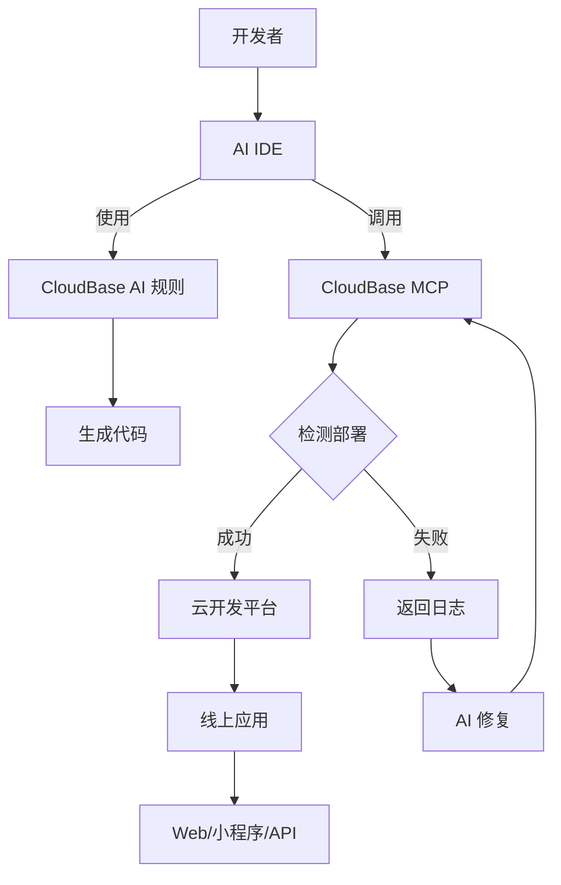

<div align="center">


# 🌟 CloudBase AI ToolKit

**通过AI提示词和MCP协议+云开发，让开发更智能、更高效**


[](https://opensource.org/licenses/MIT)
[](https://badge.fury.io/js/%40cloudbase%2Fcloudbase-mcp)

[](https://github.com/TencentCloudBase/CloudBase-AI-ToolKit/stargazers)
[](https://github.com/TencentCloudBase/CloudBase-AI-ToolKit/network/members)

[](https://github.com/TencentCloudBase/CloudBase-AI-ToolKit/issues)
[](https://github.com/TencentCloudBase/CloudBase-AI-ToolKit/pulls)
[](https://github.com/TencentCloudBase/CloudBase-AI-ToolKit/commits)
[](https://github.com/TencentCloudBase/CloudBase-AI-ToolKit/graphs/contributors)

当你在**Cursor/ VSCode GitHub Copilot/WinSurf/CodeBuddy**等AI编程工具里写代码时，它能自动帮你生成可直接部署的前后端应用+小程序，并一键发布到腾讯云开发 CloudBase。


**完整视频演示**

https://github.com/user-attachments/assets/2b402fa6-c5c4-495a-b85b-f5d4a25daa4a


### 🚀 三大核心能力

**🤖 AI智能开发**: AI自动生成代码和架构设计 <br>**☁️ 云开发集成**: 一键接入数据库、云函数、静态托管 <br>**⚡ 快速部署**: 几分钟内完成全栈应用上线
### 🛠️ 支持平台

**Web应用**: 现代化前端 + 静态托管<br>**微信小程序**: 云开发小程序解决方案<br>**后端服务**: 云数据库 + 无服务器函数+云托管

</div> 

## ✨ 核心特性

| 特性 | 说明 | 优势 |
|------|------|------|
| **🤖 AI 原生** | 专为 AI 编程工具设计的规则库 | 生成代码符合云开发最佳实践 |
| **🚀 一键部署** | MCP 自动化部署到腾讯云开发 CloudBase 平台 | Serverless 架构，无需购买服务器 |
| **📱 全栈应用支持** | Web + 小程序 + 数据库 + 后端一体化 | 支持小程序/web 等多种应用形式,提供后端托管和数据库 |
| **🔧 智能修复** | AI 自动查看日志并修复问题 | 降低运维成本 |
| **⚡ 极速体验** | 国内 CDN 加速 | 比海外平台访问速度更快 |


## 🚀 快速开始


### 0.前置条件

#### 1. 安装 AI 开发工具
例如：
- [Cursor](https://www.cursor.com/) 
- [WindSurf](https://windsurf.com/editor)  
- [CodeBuddy](https://copilot.tencent.com/)

#### 2. 开通云开发环境
1. 访问 [腾讯云开发控制台](https://tcb.cloud.tencent.com/dev)开通环境，新用户可以免费开通体验
2. 在控制台「概览」页面右侧获取 **环境ID**  
   （后续部署需要此 ID）

### 1. 使用模板创建项目

以下模板已经内置了云开发面向 AI IDE 的规则配置

建议选择适合你的项目模板快速开始：

- React Web应用+云开发模板：[下载代码包](https://static.cloudbase.net/cloudbase-examples/web-cloudbase-react-template.zip) ｜ [开源代码地址](https://github.com/TencentCloudBase/awesome-cloudbase-examples/tree/master/web/cloudbase-react-template)
- 小程序+云开发模板：[下载代码包](https://static.cloudbase.net/cloudbase-examples/miniprogram-cloudbase-miniprogram-template.zip) ｜ [开源代码地址](https://github.com/TencentCloudBase/awesome-cloudbase-examples/tree/master/miniprogram/cloudbase-miniprogram-template)

### 2. 配置你的 AI IDE

<details>
<summary><strong>🔧 Cursor 配置</strong></summary>

#### 步骤1：配置 MCP

1. 请修改项目中的 `.cursor/mcp.json` ，填写你的云开发环境 ID

```json
{
  "mcpServers": {
    "cloudbase-mcp": {
      "command": "npx",
      "args": ["@cloudbase/cloudbase-mcp"],
      "env": {
        "CLOUDBASE_ENV_ID": "你的云开发环境ID"
      }
    }
  }
}
```

2. 启用云开发 MCP Server

点击 Cursor 客户端右上角的 ⚙️ 图标，点击进入之后，选择"MCP"，在 MCP Server 页面，找到 cloudbase 右边的开关按钮，点击启用

#### 步骤2：添加 AI 规则

模板中已包含 `.cursor/rules/` 目录，AI 会自动识别云开发最佳实践。

</details>

<details>
<summary><strong>🌊 WindSurf 配置</strong></summary>

#### 步骤1：配置 MCP

点击 windsurf 的 Plugins icon，点击"View raw config"，在其中加入 clodubase-mcp，同时设置环境 id

```json
{
  "mcpServers": {
    "cloudbase-mcp": {
      "command": "npx",
      "args": ["@cloudbase/cloudbase-mcp"],
      "env": {
        "CLOUDBASE_ENV_ID": "你的云开发环境ID"
      }
    }
  }
}
```

#### 步骤2：AI 规则配置

模板中的 `.windsurf/` 目录包含专为 WindSurf 优化的配置。

</details>

<details>
<summary><strong>🤖 CLINE 配置</strong></summary>

#### MCP 配置
```json
{
  "mcpServers": {
    "cloudbase-mcp": {
      "command": "npx", 
      "args": ["@cloudbase/cloudbase-mcp"],
      "env": {
        "TENCENTCLOUD_SECRETID": "你的腾讯云SecretId",
        "TENCENTCLOUD_SECRETKEY": "你的腾讯云SecretKey",
        "CLOUDBASE_ENV_ID": "你的云开发环境ID"
      }
    }
  }
}
```

使用模板中的 `.clinerules/` 目录配置。

</details>

<details>
<summary><strong>👥 CodeBuddy 配置</strong></summary>

#### 配置说明
CodeBuddy 需要手动添加规则文件：

1. 使用模板中的 `.common_rules/` 目录
2. 在对话时使用 `@` 选择相应的云开发规则
3. MCP 配置同其他工具

</details>

<details>
<summary><strong>🐙 GitHub Copilot 配置</strong></summary>

#### GitHub Copilot Chat 配置

模板中的 `.github/` 目录包含 Copilot 优化配置。

</details>

<details>
<summary><strong>🎯 Trae 配置</strong></summary>

#### 配置步骤
```json
{
  "mcpServers": {
    "cloudbase-mcp": {
      "command": "npx",
      "args": ["@cloudbase/cloudbase-mcp"], 
      "env": {
        "CLOUDBASE_ENV_ID": "你的云开发环境ID"  
      }
    }
  }
}
```

使用模板中的 `.trae/rules/` 配置。

</details>

### 3. 开始开发

向 AI 描述你的需求：

```
做一个双人在线对战五子棋网站，支持联机对战
```

AI 会自动：
- 📝 生成前后端代码  
- 🚀 部署到云开发
- 🔗 返回在线访问链接

## 🎯 使用案例

### 案例1：双人在线对战五子棋

**开发过程：**
1. 输入需求："做个双人在线对战五子棋网站，支持联机对战"
2. AI 生成：Web 应用 + 云数据库 + 实时数据推送
3. 自动部署并获得访问链接

👉 **体验地址：** [五子棋游戏](https://cloud1-5g39elugeec5ba0f-1300855855.tcloudbaseapp.com/gobang/#/)

<details>
<summary>📸 查看开发截图</summary>

| 开发过程 | 最终效果 |
|---------|---------|
|  |  |
|  | 支持双人在线对战<br>实时棋局同步 |

</details>

### 案例2：AI 宠物养成小程序

**开发过程：**
1. 输入："开发一个宠物小精灵养成小程序，使用 AI 增强互动"
2. AI 生成：小程序 + 云数据库 + AI 云函数
3. 导入微信开发者工具即可发布

<details>
<summary>📸 查看开发截图与小程序预览</summary>

<table>
<tr>
<td width="50%">
<b>🖥️ 开发截图</b><br>

<br>

</td>
<td width="50%">
<b>📱 小程序预览</b><br>


<br><br>
<b>📲 体验二维码</b><br>

</td>
</tr>
</table>

</details>

### 案例3：智能问题诊断

当应用出现问题时：
1. AI 自动查看云函数日志
2. 分析错误原因并生成修复代码  
3. 自动重新部署

<details>
<summary>📸 查看智能诊断过程</summary>

<div align="center">

<br>
<i>AI 自动分析日志并生成修复方案</i>
</div>

</details>

---


## 🏗️ 架构原理



## 🌟 为什么选择 CloudBase？

- **⚡ 极速部署**：国内节点,访问速度比海外更快
- **🛡️ 稳定可靠**：330 万开发者选择的 Serverless 平台
- **🔧 开发友好**：专为AI时代设计的全栈平台
- **💰 成本优化**：Serverless 架构更具弹性，新用户开发期间可以免费体验

## 💬 技术交流群

遇到问题或想要交流经验？加入我们的技术社区！

### 🔥 微信交流群

<div align="center">

<br>
<i>扫码加入微信技术交流群</i>
</div>

**群内你可以：**
- 💡 分享你的 AI + 云开发项目
- 🤝 技术交流和开发问题沟通
- 📢 获取最新功能更新和最佳实践
- 🎯 参与产品功能讨论和建议

### 📱 其他交流方式

| 平台 | 链接 | 说明 |
|------|------|------|
| **官方文档** | [📖 查看文档](https://docs.cloudbase.net/) | 完整的云开发文档 |
| **Issue 反馈** | [🐛 提交问题](https://github.com/TencentCloudBase/CloudBase-AI-ToolKit/issues) | Bug 反馈和功能请求 |

### 🎉 社区活动

- **每周技术分享**：群内定期分享 AI + 云开发最佳实践
- **项目展示**：展示你用 AI 开发的精彩项目
- **问题答疑**：腾讯云开发团队成员在线答疑
- **新功能预览**：第一时间体验最新功能

> 💡 **提示**：加群时请备注 "CloudBase AI"，方便快速通过验证

## 🤝 贡献指南

欢迎提交 Issue 和 Pull Request！

1. Fork 本仓库
2. 创建你的特性分支 (`git checkout -b feature/AmazingFeature`)
3. 提交你的改动 (`git commit -m 'Add some AmazingFeature'`)
4. 推送到分支 (`git push origin feature/AmazingFeature`)
5. 打开一个 Pull Request

## 📄 开源协议

[MIT](LICENSE) © TencentCloudBase

---

⭐ 如果这个项目对你有帮助，请给我们一个 Star！ 
