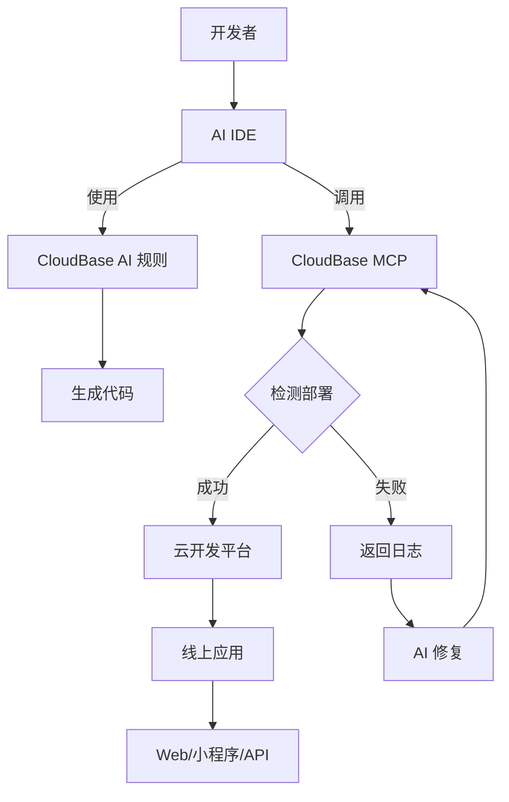

<div align="center">


# 🌟 CloudBase AI-Deploy MCP

**——用AI说话，10分钟搞定全栈应用！**

[](https://opensource.org/licenses/MIT)
[](https://badge.fury.io/js/%40cloudbase%2Fcloudbase-mcp)
[](https://github.com/TencentCloudBase/cloudbase-ai-deploy-mcp/stargazers)
[](https://github.com/TencentCloudBase/cloudbase-ai-deploy-mcp/network/members)

[](https://github.com/TencentCloudBase/cloudbase-ai-deploy-mcp/issues)
[](https://github.com/TencentCloudBase/cloudbase-ai-deploy-mcp/pulls)
[](https://github.com/TencentCloudBase/cloudbase-ai-deploy-mcp/commits)
[](https://github.com/TencentCloudBase/cloudbase-ai-deploy-mcp/graphs/contributors)

当你在**Cursor/ VSCode GitHub Copilot/WinSurf/CodeBuddy**等AI编程工具里写代码时，它能自动帮你生成可直接部署的前后端应用+小程序，并一键发布到腾讯云开发 CloudBase。

</div> 

## ✨ 核心特性

| 特性 | 说明 | 优势 |
|------|------|------|
| **🤖 AI 原生** | 专为 AI 编程工具设计的规则库 | 生成代码符合云开发最佳实践 |
| **🚀 一键部署** | MCP 自动化部署到腾讯云 | 无需手动配置服务器 |
| **📱 全栈应用支持** | Web + 小程序 + 数据库 + 后端一体化 | 支持小程序/web 等多种应用形式,提供后端托管和数据库 |
| **🔧 智能修复** | AI 自动查看日志并修复问题 | 降低运维成本 |
| **⚡ 极速体验** | 国内 CDN 加速 | 比海外平台访问速度更快 |

## 🏗️ 架构原理



## 🚀 快速开始

### 1. 使用模板创建项目

选择适合你的项目模板快速开始：

### 2. 配置你的 AI IDE

<details>
<summary><strong>🔧 Cursor 配置</strong></summary>

#### 步骤1：配置 MCP
在 Cursor 设置中添加 MCP 配置：

```json
{
  "mcpServers": {
    "cloudbase-mcp": {
      "command": "npx",
      "args": ["@cloudbase/cloudbase-mcp"],
      "env": {
        "TENCENTCLOUD_SECRETID": "你的腾讯云SecretId",
        "TENCENTCLOUD_SECRETKEY": "你的腾讯云SecretKey", 
        "CLOUDBASE_ENV_ID": "你的云开发环境ID"
      }
    }
  }
}
```

#### 步骤2：添加 AI 规则
模板中已包含 `.cursor/rules/` 目录，AI 会自动识别云开发最佳实践。

</details>

<details>
<summary><strong>🌊 WindSurf 配置</strong></summary>

#### 步骤1：配置 MCP
在 WindSurf 设置中添加：

```json
{
  "mcpServers": {
    "cloudbase-mcp": {
      "command": "npx",
      "args": ["@cloudbase/cloudbase-mcp"],
      "env": {
        "TENCENTCLOUD_SECRETID": "你的腾讯云SecretId",
        "TENCENTCLOUD_SECRETKEY": "你的腾讯云SecretKey",
        "CLOUDBASE_ENV_ID": "你的云开发环境ID"
      }
    }
  }
}
```

#### 步骤2：AI 规则配置
模板中的 `.windsurf/` 目录包含专为 WindSurf 优化的配置。

</details>

<details>
<summary><strong>🤖 CLINE 配置</strong></summary>

#### MCP 配置
```json
{
  "mcpServers": {
    "cloudbase-mcp": {
      "command": "npx", 
      "args": ["@cloudbase/cloudbase-mcp"],
      "env": {
        "TENCENTCLOUD_SECRETID": "你的腾讯云SecretId",
        "TENCENTCLOUD_SECRETKEY": "你的腾讯云SecretKey",
        "CLOUDBASE_ENV_ID": "你的云开发环境ID"
      }
    }
  }
}
```

使用模板中的 `.clinerules/` 目录配置。

</details>

<details>
<summary><strong>👥 CodeBuddy 配置</strong></summary>

#### 配置说明
CodeBuddy 需要手动添加规则文件：

1. 使用模板中的 `.common_rules/` 目录
2. 在对话时使用 `@` 选择相应的云开发规则
3. MCP 配置同其他工具

</details>

<details>
<summary><strong>🐙 GitHub Copilot 配置</strong></summary>

#### GitHub Copilot Chat 配置
模板中的 `.github/` 目录包含 Copilot 优化配置。

> 注意：GitHub Copilot 目前不支持 MCP，部分自动部署功能需要手动执行。

</details>

<details>
<summary><strong>🎯 Trae 配置</strong></summary>

#### 配置步骤
```json
{
  "mcpServers": {
    "cloudbase-mcp": {
      "command": "npx",
      "args": ["@cloudbase/cloudbase-mcp"], 
      "env": {
        "TENCENTCLOUD_SECRETID": "你的腾讯云SecretId",
        "TENCENTCLOUD_SECRETKEY": "你的腾讯云SecretKey",
        "CLOUDBASE_ENV_ID": "你的云开发环境ID"  
      }
    }
  }
}
```

使用模板中的 `.trae/rules/` 配置。

</details>

### 3. 开始开发

向 AI 描述你的需求：

```
做一个双人在线对战五子棋网站，支持联机对战
```

AI 会自动：
- 📝 生成前后端代码  
- 🚀 部署到云开发
- 🔗 返回在线访问链接

## 🎯 使用案例

### 案例1：双人在线对战五子棋

**开发过程：**
1. 输入需求："做个双人在线对战五子棋网站，支持联机对战"
2. AI 生成：Web 应用 + 云数据库 + WebSocket 云函数
3. 自动部署并获得访问链接

👉 **体验地址：** [五子棋游戏](https://cloud1-5g39elugeec5ba0f-1300855855.tcloudbaseapp.com/gobang/#/)

<details>
<summary>📸 查看开发截图</summary>

| 开发过程 | 最终效果 |
|---------|---------|
|  |  |
|  | 支持双人在线对战<br>实时棋局同步 |

</details>

### 案例2：AI 宠物养成小程序

**开发过程：**
1. 输入："开发一个宠物小精灵养成小程序，使用 AI 增强互动"
2. AI 生成：小程序 + 云数据库 + AI 云函数
3. 导入微信开发者工具即可发布

<details>
<summary>📸 查看开发截图与小程序预览</summary>

<table>
<tr>
<td width="50%">
<b>🖥️ 开发截图</b><br>

<br>

</td>
<td width="50%">
<b>📱 小程序预览</b><br>


<br><br>
<b>📲 体验二维码</b><br>

</td>
</tr>
</table>

</details>

### 案例3：智能问题诊断

当应用出现问题时：
1. AI 自动查看云函数日志
2. 分析错误原因并生成修复代码  
3. 自动重新部署

<details>
<summary>📸 查看智能诊断过程</summary>

<div align="center">

<br>
<i>AI 自动分析日志并生成修复方案</i>
</div>

</details>

---

### 🎨 更多案例预览

<details>
<summary>点击查看更多项目案例</summary>

| 项目类型 | 预览 | 特性 |
|---------|------|------|
| **电商小程序** | 🛒 商品展示、购物车、支付 | 云数据库 + 云函数 + 支付接口 |
| **内容管理系统** | 📝 文章发布、用户管理 | 权限控制 + 富文本编辑 |
| **实时聊天应用** | 💬 群聊、私聊、表情包 | WebSocket + 云存储 |
| **数据可视化** | 📊 图表展示、实时更新 | 云函数 + 第三方图表库 |

</details>

## 🌟 为什么选择 CloudBase？

- **🇨🇳 国内领先**：330万+开发者的选择
- **⚡ 极速部署**：国内节点，速度比海外快3-5倍  
- **🛡️ 稳定可靠**：腾讯云基础设施，99.95%可用性
- **🔧 开发友好**：专为AI时代设计的全栈平台
- **💰 成本优化**：按量付费，开发测试几乎免费

## 📚 进阶文档

- [云开发快速入门](https://docs.cloudbase.net/quick-start/)
- [MCP 完整配置指南](https://github.com/TencentCloudBase/cloudbase-mcp)
- [小程序开发最佳实践](https://developers.weixin.qq.com/miniprogram/dev/wxcloud/)
- [云函数开发指南](https://docs.cloudbase.net/cloud-function/)

## 🤝 贡献指南

欢迎提交 Issue 和 Pull Request！

1. Fork 本仓库
2. 创建你的特性分支 (`git checkout -b feature/AmazingFeature`)
3. 提交你的改动 (`git commit -m 'Add some AmazingFeature'`)
4. 推送到分支 (`git push origin feature/AmazingFeature`)
5. 打开一个 Pull Request

## 📄 开源协议

[MIT](LICENSE) © TencentCloudBase

---

⭐ 如果这个项目对你有帮助，请给我们一个 Star！ 
