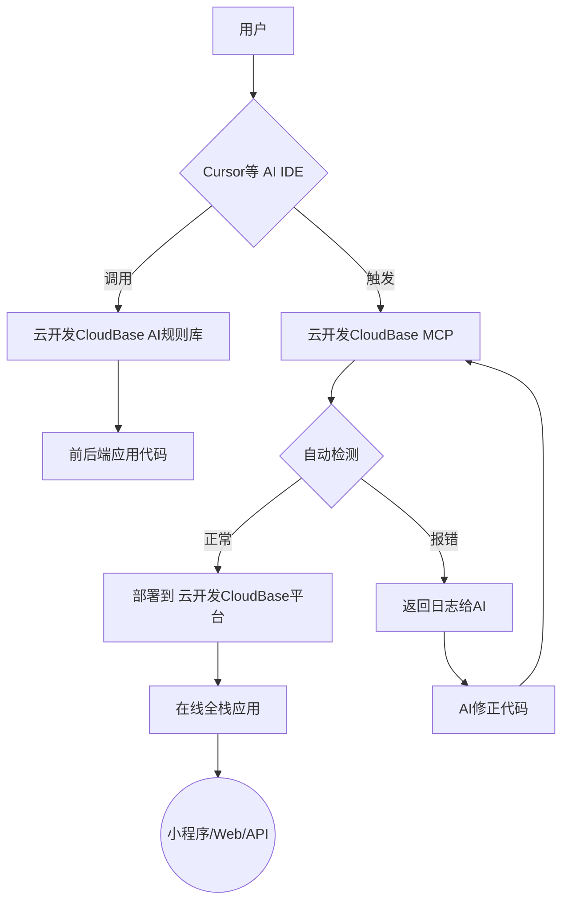

# 🌟 CloudBase TurboDeploy AI开发套件

**——用AI说话，10分钟搞定全栈应用！**

## 🧐 这是什么？

它是 AI IDE 和编程助手的的**最佳排档**

当你在**Cursor/GitHub Copilot/WinSurf/CodeBuddy**等AI编程工具里写代码时，它能自动帮你：  
- 1️⃣ **生成**可直接部署的前后端应用+小程序  
- 2️⃣ **一键发布**到腾讯云开发 CloudBase 
- 3️⃣ **智能修复**线上问题

全程不用碰服务器，像搭积木一样简单！

## 🚀 三大核心能力

| 模块                   | 功能                  | 小白理解                      |
| --------------------- | ------------------- | ------------------------- |
| **云开发 CloudBase AI规则** | 为Cursor等IDE定制代码生成规则 | 教AI按腾讯云开发 CloudBase的标准写代码 |
| **云开发 CloudBaseMCP**  | 自动部署/监控/管理资源        | 你的云端"自动驾驶系统"              |
| **云开发 CloudBase 平台** | 前后端+数据库一体化托管        | 全栈应用的"集装箱"                |

## 🔄 工作流程图



## 💡 典型使用场景

**案例1：快速上线双人在线对战五子棋网站**


1. 在Cursor输入："做个双人在线对战五子棋网站，支持联机对战"
2. AI自动生成：web 应用 + 云开发数据库API + 云函数+ websocket 实时推送
3. 自动部署前后端资源，并得到现网可访问地址
4. 用户可持续和 AI 互动不断增加功能，并部署
5. 遇到问题后，可以把问题交给 AI 让 AI 查询云函数日志并解决，然后进行部署

### 开发示例


### 应用体验

👉 点击访问 [生成产物访问地址](https://cloud1-5g39elugeec5ba0f-1300855855.tcloudbaseapp.com/gobang/#/)


**案例2：快速上线一个有 AI功能的宠物小程序**


1. 在Cursor输入："开发一个宠物小精灵的养成小程序游戏，使用 AI 来增强角色的互动等玩法  
支持每个用户领养自己的小精灵"
2. AI自动生成：小程序 + 云开发数据库API + 云函数
3. 自动部署云函数，数据库等云开发资源
4. 导入到微信 IDE 后，发布小程序即可获得生产环境小程序
5. 用户可持续修改和完善新功能

### 开发示例


### 应用体验

小程序体验二维码


**案例3：智能监控修复**  
当用户反馈页面报错时：

1. AI通过MCP查看云函数错误日志，或者查看数据库集合写入情况
2. 自动生成补丁代码并重新部署
3. 问题解决无需人工介入


## 🎯 为什么选择我们？

√ **国内速度最快** 腾讯云国内节点，部署比海外平台快3-5倍  
√ **稳定可靠** 国内累计有 330万开发者使用云开发开发小程序和其他应用
√ **全家桶支持** 唯一同时支持Web+小程序+API的一站式平台  
√ **AI深度优化** 专为AI开发者打造全栈应用代码生成规则

## 🏁 使用指南

### 1. 新建项目

在本地创建一个空白项目，下载并集成云开发 CloudBase AI规则

根据你使用的AI工具，将相应的规则目录复制到项目中：

| AI工具 | 规则目录 | 使用方法 |
|--------|---------|---------|
| **Cursor** | `.cursor/rules/` | 复制到项目根目录 |
| **WindSurf** | `.windsurf/` | 复制到项目根目录 |
| **CLINE** | `.clinerules/` | 复制到项目根目录 |
| **CodeBuddy** | `.common_rules/` | 复制到项目根目录，对话时需要 add 选中具体的规则 |
| **Github Copilot** | `.github/` | 复制到项目根目录 |
| **Trae** | `.trae/rules/` | 复制到项目根目录 |
| 通用规则 | `.common_rules/` | 适用于所有支持规则的AI工具，不支持的情况下需要 add 选中具体的规则 |

所有规则文件都包含相同的CloudBase开发指南，只是格式和位置根据不同AI工具而调整

### 2. 配置云开发 CloudBase MCP

在 Cursor 等支持 MCP 的 AI IDE 中，打开 MCP 配置，加入云开发的 MCP

注意：需要先[开通云开发环境](https://docs.cloudbase.net/quick-start/create-env)

```js
{
  "mcpServers": {
    "cloudbase-mcp": {
      "command": "npx",
      "args": ["@cloudbase/cloudbase-mcp"],
      "env": {
        "TENCENTCLOUD_SECRETID": "腾讯云 SecretId",
        "TENCENTCLOUD_SECRETKEY": "腾讯云 SecretKey",
        "CLOUDBASE_ENV_ID": "云开发环境 ID"
      }
    }
  }
}
```

### 3. 输入需求并生成

对AI说："我要做一个______"

例如
```
做个双人在线对战五子棋网站，支持联机对战
```

等着收你的线上应用链接或者小程序吧！


## 📄 开源协议

[MIT](LICENSE) 