<div align="center">


# 🌟 CloudBase AI ToolKit

**通过AI提示词和MCP协议+云开发，让开发更智能、更高效**

**🌍 Languages:** **中文** | [English](README-EN.md)


[](https://opensource.org/licenses/MIT)
[](https://www.npmjs.com/package/@cloudbase/cloudbase-mcp)
[](https://www.npmjs.com/package/@cloudbase/cloudbase-mcp)
[](https://github.com/TencentCloudBase/CloudBase-AI-ToolKit/stargazers)
[](https://github.com/TencentCloudBase/CloudBase-AI-ToolKit/network/members)

[](https://github.com/TencentCloudBase/CloudBase-AI-ToolKit/issues)
[](https://github.com/TencentCloudBase/CloudBase-AI-ToolKit/pulls)
[](https://github.com/TencentCloudBase/CloudBase-AI-ToolKit/commits)
[](https://github.com/TencentCloudBase/CloudBase-AI-ToolKit/graphs/contributors)
[](https://cnb.cool/tencent/cloud/cloudbase/CloudBase-AI-ToolKit)
[](https://deepwiki.com/TencentCloudBase/CloudBase-AI-ToolKit)

当你在**Cursor/ VSCode GitHub Copilot/WinSurf/CodeBuddy/Augment Code/Claude Code**等AI编程工具里写代码时，它能自动帮你生成可直接部署的前后端应用+小程序，并一键发布到腾讯云开发 CloudBase。


**📹 完整视频演示 ⬇️**

<a href="https://www.bilibili.com/video/BV1hpjvzGESg/" target="_blank">
  
</a>

| 🚀 **核心能力** | 🛠️ **支持平台** |
|---|---|
| 🤖 **AI智能开发**: AI自动生成代码和架构设计<br>☁️ **云开发集成**: 一键接入数据库、云函数、静态托管<br>⚡ **快速部署**: 几分钟内完成全栈应用上线 | **Web应用**: 现代化前端 + 静态托管<br>**微信小程序**: 云开发小程序解决方案<br>**后端服务**: 云数据库 + 无服务器函数+云托管 |


</div> 

## ✨ 核心特性

- **🤖 AI 原生** - 专为 AI 编程工具设计的规则库，生成代码符合云开发最佳实践
- **🚀 一键部署** - MCP 自动化部署到腾讯云开发 CloudBase 平台，Serverless 架构无需购买服务器
- **📱 全栈应用** - Web + 小程序 + 数据库 + 后端一体化，支持多种应用形式和后端托管
- **🔧 智能修复** - AI 自动查看日志并修复问题，降低运维成本
- **⚡ 极速体验** - 国内 CDN 加速，比海外平台访问速度更快
- **📚 知识检索** - 内置云开发、微信小程序等专业知识库的智能向量检索


## 🚀 快速开始


### 0. 前置条件

<details>
<summary>安装 AI 开发工具</summary>

例如 [Cursor](https://www.cursor.com/) | [WindSurf](https://windsurf.com/editor) | [CodeBuddy](https://copilot.tencent.com/) 等，点击查看 [支持的 AI 开发工具列表](#2-配置你的-ai-ide)

</details>

<details>
<summary>开通云开发环境</summary>

访问 [腾讯云开发控制台](https://tcb.cloud.tencent.com/dev)开通环境，新用户可以免费开通体验。

</details>

<details>
<summary>安装 Node.js v18及以上版本</summary>

确保您的计算机上安装了 Node.js v18 及以上版本。您可以从 [Node.js 官网](https://nodejs.org/) 下载并安装最新版本。

</details>

<details>
<summary>可选：设置 npm 源</summary>

为了提高依赖包的下载速度，建议将 npm 源设置为腾讯镜像源。您可以在**终端命令行**中运行以下命令：

```bash
npm config set registry https://mirrors.cloud.tencent.com/npm/
```

这样可以加快依赖包的下载速度，特别是在中国大陆地区。
</details>

<details>
<summary>可选：清理 npx 缓存</summary>
由于 npx 这个工具本身存在一个缓存的 bug，可能导致 CloudBase AI ToolKit 安装问题，您可以尝试清理 npx 缓存。

在**终端命令行**中运行以下命令：
```
npx -y clear-npx-cache 
```
</details>

### 1. 快速初始化或增强你的项目

我们为你准备了内置云开发最佳实践和 AI IDE 规则的项目模板，推荐如下两种方式：

#### 🚀 新项目推荐

选择适合你的模板，一键初始化：

- **微信小程序 + 云开发模板**  
  [下载代码包](https://static.cloudbase.net/cloudbase-examples/miniprogram-cloudbase-miniprogram-template.zip?v=2025053001) ｜ [开源代码地址](https://github.com/TencentCloudBase/awesome-cloudbase-examples/tree/master/miniprogram/cloudbase-miniprogram-template)

- **React Web 应用 + 云开发模板**  
  [下载代码包](https://static.cloudbase.net/cloudbase-examples/web-cloudbase-react-template.zip?v=2025053001) ｜ [开源代码地址](https://github.com/TencentCloudBase/awesome-cloudbase-examples/tree/master/web/cloudbase-react-template)

- **Vue Web 应用 + 云开发模板**  
  [下载代码包](https://static.cloudbase.net/cloudbase-examples/web-cloudbase-vue-template.zip?v=2025053001) ｜ [开源代码地址](https://github.com/TencentCloudBase/awesome-cloudbase-examples/tree/master/web/cloudbase-vue-template)

- **UniApp 跨端应用 + 云开发模板**  
  [下载代码包](https://static.cloudbase.net/cloudbase-examples/universal-cloudbase-uniapp-template.zip?v=2025053001) ｜ [开源代码地址](https://github.com/TencentCloudBase/awesome-cloudbase-examples/tree/master/universal/cloudbase-uniapp-template)

- **AI 规则通用云开发模板** ：不限定语言和框架，内置 CloudBase AI 规则和MCP，适用于任意云开发项目

  [下载代码包](https://static.cloudbase.net/cloudbase-examples/web-cloudbase-project.zip) ｜ [开源代码地址](https://github.com/TencentCloudBase/awesome-cloudbase-examples/tree/master/web/cloudbase-project)

#### 🛠️ 已有项目增强

如果你已经有自己的项目，只需在配置好 MCP 后，只需要对 AI 说 "在当前项目中下载云开发 AI 规则"，即可一键下载并补全 AI 编辑器规则配置到当前项目目录，无需手动操作。


### 2. 配置你的 AI IDE

> [!TIP]
> 温馨提示：如果你使用的是模板项目，所有配置都已经预置完成,请按照指引进行检查和开启工具。如果不是从模板开始，需要按具体的说明手动添加相应配置：

以下工具均支持 CloudBase AI ToolKit，选择合适的工具并按说明配置：

| 工具 | 支持平台 |
|------|----------|
| [Cursor](https://cursor.com/) | 独立 IDE|
| [WindSurf](https://windsurf.com/editor) | 独立 IDE, VSCode、JetBrains 插件 |
| [CodeBuddy](https://copilot.tencent.com/) | VS Code、JetBrains、微信开发者工具插件 |
| [CLINE](https://cline.so/) | VS Code 插件 |
| [GitHub Copilot](https://github.com/features/copilot) | VS Code 插件 |
| [Trae](https://www.trae.ai/) | 独立 IDE |
| [通义灵码](https://tongyi.aliyun.com/lingma) | 独立 IDE，VS Code、 JetBrains插件 |
| [RooCode](https://roocode.com/) | VS Code插件 |
| [文心快码](https://comate.baidu.com/) | VS Code、JetBrains插件|
| [Augment Code](https://www.augmentcode.com/) | VS Code、JetBrains 插件 |
| [Claude Code](https://www.anthropic.com/claude-code) | 命令行工具 |

<details>
<summary><strong>🔧 Cursor 配置</strong></summary>

#### 步骤1：使用 AI 规则

模板中已包含 `.cursor/rules/` 目录，AI 会自动识别云开发最佳实践。如果不是从模板开始，可以让 AI 帮你下载云开发规则。

#### 步骤2：配置 MCP


> [!TIP] 
> 如果安装以后工具数量一直为 0，请参考[常见问题](https://docs.cloudbase.net/ai/cloudbase-ai-toolkit/faq#mcp-%E6%98%BE%E7%A4%BA%E5%B7%A5%E5%85%B7%E6%95%B0%E9%87%8F%E4%B8%BA-0-%E6%80%8E%E4%B9%88%E5%8A%9E)

如果使用模板项目，MCP 配置已经预置完成，请点击左下角的弹出的窗口启用MCP。如果不是从模板开始，可以点击下方按钮安装到 Cursor 中：

[](https://cursor.com/install-mcp?name=CloudBase&config=eyJjb21tYW5kIjoibnB4IEBjbG91ZGJhc2UvY2xvdWRiYXNlLW1jcEBsYXRlc3QiLCJkaXNhYmxlZCI6ZmFsc2V9)

或手动添加配置到 `.cursor/mcp.json`：

```json
{
  "mcpServers": {
    "cloudbase-mcp": {
      "command": "npx",
      "args": ["-y", "@cloudbase/cloudbase-mcp@latest"]
    }
  }
}
```

然后点击 Cursor 客户端右上角的 ⚙️ 图标，进入"MCP"设置，找到 cloudbase 并启用。

#### 步骤3：切换到 Agent 模式

在对话窗口中使用 Agent 进行代码生成和自动化操作。

</details>

<details>
<summary><strong>🌊 Codeium/WindSurf 配置</strong></summary>

#### 步骤1：使用 AI 规则

模板中的 `.windsurf/` 目录包含专为 WindSurf 优化的配置。如果不是从模板开始，可以让 AI 帮你下载云开发规则。

#### 步骤2：配置 MCP

> [!TIP] 
> 如果安装以后工具数量一直为 0，请参考[常见问题](https://docs.cloudbase.net/ai/cloudbase-ai-toolkit/faq#mcp-%E6%98%BE%E7%A4%BA%E5%B7%A5%E5%85%B7%E6%95%B0%E9%87%8F%E4%B8%BA-0-%E6%80%8E%E4%B9%88%E5%8A%9E)

如果使用模板项目，MCP 配置已经预置完成。如果不是从模板开始，需要在 WindSurf 的 Plugins 配置中添加：

```json
{
  "mcpServers": {
    "cloudbase-mcp": {
      "command": "npx",
      "args": ["-y", "@cloudbase/cloudbase-mcp@latest"]
    }
  }
}
```


#### 步骤3：切换到 Write 模式

在对话中切换到 Write 模式进行智能生成。

</details>

<details>
<summary><strong>👥 CodeBuddy 配置</strong></summary>

#### 步骤1：使用 AI 规则

模板中已包含 `.rules/` 目录，CodeBuddy 会自动识别云开发最佳实践。如果不是从模板开始，可以让 AI 帮你下载云开发规则。

#### 步骤2：配置 MCP


> 如果安装以后工具数量一直为 0，请参考[常见问题](https://docs.cloudbase.net/ai/cloudbase-ai-toolkit/faq#mcp-%E6%98%BE%E7%A4%BA%E5%B7%A5%E5%85%B7%E6%95%B0%E9%87%8F%E4%B8%BA-0-%E6%80%8E%E4%B9%88%E5%8A%9E)

1. 可以在 点开 CodeBuddy 右上角的 MCP 按钮，在 MCP 市场中搜索 CloudBase，然后点击安装即可。

2. 也可以手动添加，点开 CodeBuddy 右上角的 MCP 按钮，点击右侧的添加，在 MCP 配置中添加云开发的 MCP

```json
{
  "mcpServers": {
    "cloudbase": {
      "command": "npx",
      "args": ["-y", "@cloudbase/cloudbase-mcp@latest"]
    }
  }
}
```


#### 步骤3：切换到 Craft 智能体

在对话窗口中切换到 Craft 模式。建议在右侧设置中关闭确认计划功能，以获得更流畅的体验。

</details>

<details>
<summary><strong>🤖 CLINE 配置</strong></summary>

#### 步骤1：使用 AI 规则

模板中已包含 `.clinerules/` 目录，AI 会自动识别云开发最佳实践。如果不是从模板开始，可以让 AI 帮你下载云开发规则。

#### 步骤2：配置 MCP


> [!TIP] 
> 如果安装以后工具数量一直为 0，请参考[常见问题](https://docs.cloudbase.net/ai/cloudbase-ai-toolkit/faq#mcp-%E6%98%BE%E7%A4%BA%E5%B7%A5%E5%85%B7%E6%95%B0%E9%87%8F%E4%B8%BA-0-%E6%80%8E%E4%B9%88%E5%8A%9E)

如果使用模板项目，MCP 配置已经预置完成。如果不是从模板开始，需要在 MCP Server 配置中添加：

```json
{
  "mcpServers": {
    "cloudbase": {
      "autoApprove": [],
      "timeout": 60,
      "command": "npx",
      "args": [
        "@cloudbase/cloudbase-mcp@latest"
      ],
      "transportType": "stdio",
      "disabled": false
    }
  }
}
```

#### 步骤3：使用 AI 对话

建议使用支持代码生成和 function call 的模型。

</details>

<details>
<summary><strong>🐙 GitHub Copilot 配置</strong></summary>

#### 步骤1：使用 AI 规则

模板中的 `.github/` 目录包含 Copilot 优化配置。如果不是从模板开始，可以让 AI 帮你下载云开发规则。

#### 步骤2：配置 MCP


> [!TIP] 
> 如果安装以后工具数量一直为 0，请参考[常见问题](https://docs.cloudbase.net/ai/cloudbase-ai-toolkit/faq#mcp-%E6%98%BE%E7%A4%BA%E5%B7%A5%E5%85%B7%E6%95%B0%E9%87%8F%E4%B8%BA-0-%E6%80%8E%E4%B9%88%E5%8A%9E)

如果使用模板项目，MCP 配置已经预置完成。如果不是从模板开始，需要在 `.vscode/mcp.json` 中添加：

```json
{
    "servers": {
        "cloudbase": {
            "command": "npx",
            "args": [
                "@cloudbase/cloudbase-mcp@latest"
            ]
        }
    }
}
```

#### 步骤3：切换到 Agent 模式

在对话窗口左下角切换到 Agent 模式进行对话。

</details>

<details>
<summary><strong>🎯 Trae 配置</strong></summary>

本操作指引支持 Trae 国际版和 Trae CN 版本，建议使用 Claude/DeepSeek V3 0324 等模型进行测试。

#### 步骤1：使用 AI 规则

模板中的 `.trae/rules` 目录包含面向 Trae 的云开发规则配置。如果不是从模板开始，可以让 AI 帮你下载云开发规则。

#### 步骤2：配置 MCP


> [!TIP] 
> 如果安装以后工具数量一直为 0，请参考[常见问题](https://docs.cloudbase.net/ai/cloudbase-ai-toolkit/faq#mcp-%E6%98%BE%E7%A4%BA%E5%B7%A5%E5%85%B7%E6%95%B0%E9%87%8F%E4%B8%BA-0-%E6%80%8E%E4%B9%88%E5%8A%9E)

需要在 Trae 的MCP 配置中添加：

```json
{
  "mcpServers": {
    "cloudbase-mcp": {
      "command": "npx",
      "args": ["-y", "@cloudbase/cloudbase-mcp@latest"]
    }
  }
}
```

#### 步骤3：使用 Builder with MCP 对话

在智能体中选择 Builder with MCP 进行对话。

</details>

<details>
<summary><strong>🧩 通义灵码 配置</strong></summary>

#### 步骤1：使用 AI 规则

模板中已包含 `.lingma/` 目录，通义灵码会自动识别云开发最佳实践。如果不是从模板开始，可以让 AI 帮你下载云开发规则。

#### 步骤2：配置 MCP


> [!TIP] 
> 如果安装以后工具数量一直为 0，请参考[常见问题](https://docs.cloudbase.net/ai/cloudbase-ai-toolkit/faq#mcp-%E6%98%BE%E7%A4%BA%E5%B7%A5%E5%85%B7%E6%95%B0%E9%87%8F%E4%B8%BA-0-%E6%80%8E%E4%B9%88%E5%8A%9E)

如果使用模板项目，MCP 配置已经预置完成。如果不是从模板开始，需要在 MCP 配置中添加：

```json
{
  "mcpServers": {
    "cloudbase-mcp": {
      "command": "npx",
      "args": ["-y", "@cloudbase/cloudbase-mcp@latest"]
    }
  }
}
```

#### 步骤3：切换到智能体模式

在对话窗口左下角切换到智能体模式。

</details>

<details>
<summary><strong>🤖 RooCode 配置</strong></summary>

#### 步骤1：使用 AI 规则

模板中已包含 `.roo/rules` 目录，RooCode 会自动识别云开发最佳实践。如果不是从模板开始，可以让 AI 帮你下载云开发规则。

#### 步骤2：配置 MCP


> [!TIP] 
> 如果安装以后工具数量一直为 0，请参考[常见问题](https://docs.cloudbase.net/ai/cloudbase-ai-toolkit/faq#mcp-%E6%98%BE%E7%A4%BA%E5%B7%A5%E5%85%B7%E6%95%B0%E9%87%8F%E4%B8%BA-0-%E6%80%8E%E4%B9%88%E5%8A%9E)

如果使用模板项目，MCP 配置已经预置完成。如果不是从模板开始，需要在 MCP 配置中添加：

```json
{
    "mcpServers": {
        "cloudbase": {
            "command": "npx",
            "args": [
                "@cloudbase/cloudbase-mcp@latest"
            ],
            "disabled": false
        }
    }
}
```

#### 步骤3：使用 AI 对话

在对话窗口中进行代码生成和自动化操作。

</details>

<details>
<summary><strong>🤖 文心快码(Baidu Comate) 配置</strong></summary>

#### 步骤1：使用 AI 规则

模板中已包含 `.comate/rules` 目录，文心快码会自动识别云开发最佳实践。如果不是从模板开始，可以让 AI 帮你下载云开发规则。

#### 步骤2：配置 MCP


> [!TIP] 
> 如果安装以后工具数量一直为 0，请参考[常见问题](https://docs.cloudbase.net/ai/cloudbase-ai-toolkit/faq#mcp-%E6%98%BE%E7%A4%BA%E5%B7%A5%E5%85%B7%E6%95%B0%E9%87%8F%E4%B8%BA-0-%E6%80%8E%E4%B9%88%E5%8A%9E)

如果使用模板项目，MCP 配置已经预置完成。如果不是从模板开始，需要在 MCP 配置中添加：

```json
{
    "mcpServers": {
        "cloudbase": {
            "command": "npx",
            "args": [
                "@cloudbase/cloudbase-mcp@latest"
            ],
            "disabled": false
        }
    }
}
```


#### 步骤3：使用 AI 对话

在对话窗口中切换到 Zulu 模式进行操作。

</details>


<details>
<summary><strong>🚀 Augment Code 配置</strong></summary>

#### 步骤1：使用 AI 规则

模板中已包含 `.augment-guidelines` 文件，Augment Code 会自动识别云开发最佳实践。如果不是从模板开始，可以让 AI 帮你下载云开发规则

#### 步骤2：配置 MCP


> [!TIP] 
> 如果安装以后工具数量一直为 0，请参考[常见问题](https://docs.cloudbase.net/ai/cloudbase-ai-toolkit/faq#mcp-%E6%98%BE%E7%A4%BA%E5%B7%A5%E5%85%B7%E6%95%B0%E9%87%8F%E4%B8%BA-0-%E6%80%8E%E4%B9%88%E5%8A%9E)

如果使用模板项目，MCP 配置已经预置完成(内置在`.vscode/settings.json`中)。如果不是从模板开始，需要在 Augment的 MCP 配置中添加云开发 MCP，[参考文档](https://docs.augmentcode.com/setup-augment/mcp)：

```json
{
  "augment.advanced": {
     "mcpServers": {
        "cloudbase": {
            "command": "npx",
            "args": [
                "@cloudbase/cloudbase-mcp@latest"
            ]
        }
    }
  }
}
```

#### 步骤3：使用 Agent 模式

在对话窗口中使用 Agent 模式进行智能代码生成和自动化操作。

</details>

<details>
<summary><strong>🤖 Claude Code 配置</strong></summary>

#### 步骤1：使用 AI 规则

模板中已包含 `CLAUDE.md` 文件，Claude Code 会自动识别云开发最佳实践。如果不是从模板开始，可以让 AI 帮你下载云开发规则

#### 步骤2：配置 MCP


> [!TIP] 
> 如果安装以后工具数量一直为 0，请参考[常见问题](https://docs.cloudbase.net/ai/cloudbase-ai-toolkit/faq#mcp-%E6%98%BE%E7%A4%BA%E5%B7%A5%E5%85%B7%E6%95%B0%E9%87%8F%E4%B8%BA-0-%E6%80%8E%E4%B9%88%E5%8A%9E)

如果使用模板项目，MCP 配置已经预置完成。如果不是从模板开始，需要在项目根目录创建 `.mcp.json` 文件：

```json
{
  "mcpServers": {
    "cloudbase": {
      "command": "npx",
      "args": [
        "-y",
        "@cloudbase/cloudbase-mcp@latest"
      ]
    }
  }
}
```

#### 步骤3：使用 AI 对话

在 Claude Code 中直接与 AI 对话进行智能代码生成和自动化操作。

</details>

<details>
<summary><strong>🔄 更新 CloudBase AI ToolKit</strong></summary>

**更新 AI 规则**

如果你想在现有项目中更新到最新的云开发 AI 规则，只需对 AI 说：

```
下载云开发 AI 规则
```

AI 会自动下载并更新最新的规则配置到你的项目目录。

**更新 MCP 工具**

当有新版本的 MCP 工具发布时，你可以通过以下方式更新：

1. **自动更新（推荐）**：在你的 AI 开发工具的 MCP 列表中，找到 cloudbase-mcp 并重新启用或刷新 MCP 列表即可自动安装最新版本

2. **手动更新**：如果自动更新不成功，可以先禁用再重新启用 cloudbase-mcp，或者重启你的 AI IDE

由于 MCP 配置中使用了 `@latest` 标签，通常会自动获取最新版本。

</details>


### 3. 开始开发


在开始使用前，只需要对 AI 说

```
登录云开发
```
AI 就会自动完成弹出登录腾讯云界面以及云开发的环境选择

后续如需切换环境，可以说

```
退出云开发
```

AI 就会清理本地的配置，后续可以再要求 AI 登录云开发来重新登录。

在登录成功后，可以确认 AI 已经连接到云开发

```
查询当前云开发环境信息
```

向 AI 描述你的需求,进行开发：

```
做一个双人在线对战五子棋网站，支持联机对战，最后进行部署
```

AI 会自动：
- 📝 生成前后端代码  
- 🚀 部署到云开发
- 🔗 返回在线访问链接

开发过程中如果遇到报错，可以把错误信息发给 AI 来进行排障

```
报错了，错误是xxxx
```


也可以让 AI 结合云函数日志进行调试和修改代码

```
云函数代码运行不符合需求，需求是 xxx，请查看日志和数据进行调试，并进行修复
```


## 📚 教程

### 📄 文章
- [1小时开发微信小游戏《我的早餐店》——基于CloudBase AI Toolkit](https://cloud.tencent.com/developer/article/2532595)
- [AI Coding宝藏组合：Cursor + Cloudbase-AI-Toolkit 开发游戏实战](https://juejin.cn/post/7518783423277695028#comment)

### 📱 应用项目
- [简历助手小程序](https://gitcode.com/qq_33681891/resume_template)

### 🎥 视频教程
- [云开发CloudBase：用AI开发一款分手厨房小游戏](https://www.bilibili.com/video/BV1v5KAzwEf9/)

---

## 🎯 使用案例

### 案例1：双人在线对战五子棋

**开发过程：**
1. 输入需求："做个双人在线对战五子棋网站，支持联机对战"
2. AI 生成：Web 应用 + 云数据库 + 实时数据推送
3. 自动部署并获得访问链接

👉 **体验地址：** [五子棋游戏](https://cloud1-5g39elugeec5ba0f-1300855855.tcloudbaseapp.com/gobang/#/)

<details>
<summary>📸 查看开发截图</summary>

| 开发过程 | 最终效果 |
|---------|---------|
|  |  |
|  | 支持双人在线对战<br>实时棋局同步 |

</details>

### 案例2：AI 宠物养成小程序

**开发过程：**
1. 输入："开发一个宠物小精灵养成小程序，使用 AI 增强互动"
2. AI 生成：小程序 + 云数据库 + AI 云函数
3. 导入微信开发者工具即可发布

<details>
<summary>📸 查看开发截图与小程序预览</summary>

<table>
<tr>
<td width="50%">
<b>🖥️ 开发截图</b><br>

<br>

</td>
<td width="50%">
<b>📱 小程序预览</b><br>


<br><br>
<b>📲 体验二维码</b><br>

</td>
</tr>
</table>

</details>

### 案例3：智能问题诊断

当应用出现问题时：
1. AI 自动查看云函数日志
2. 分析错误原因并生成修复代码  
3. 自动重新部署

<details>
<summary>📸 查看智能诊断过程</summary>

<div align="center">

<br>
<i>AI 自动分析日志并生成修复方案</i>
</div>

</details>

---

## 🌟 为什么选择 CloudBase？

- **⚡ 极速部署**：国内节点,访问速度比海外更快
- **🛡️ 稳定可靠**：330 万开发者选择的 Serverless 平台
- **🔧 开发友好**：专为AI时代设计的全栈平台，支持自动环境配置
- **💰 成本优化**：Serverless 架构更具弹性，新用户开发期间可以免费体验


## 📋 常见问题 FAQ

如有迁移、集成等常见疑问，请查阅 [FAQ 常见问题](https://docs.cloudbase.net/ai/cloudbase-ai-toolkit/faq)。 

## 💬 技术交流群

遇到问题或想要交流经验？加入我们的技术社区！

### 🔥 微信交流群

<div align="center">

<br>
<i>扫码加入微信技术交流群</i>
</div>

**群内你可以：**
- 💡 分享你的 AI + 云开发项目
- 🤝 技术交流和开发问题沟通
- 📢 获取最新功能更新和最佳实践
- 🎯 参与产品功能讨论和建议

### 📱 其他交流方式

| 平台 | 链接 | 说明 |
|------|------|------|
| **官方文档** | [📖 查看文档](https://docs.cloudbase.net/) | 完整的云开发文档 |
| **Issue 反馈** | [🐛 提交问题](https://github.com/TencentCloudBase/CloudBase-AI-ToolKit/issues) | Bug 反馈和功能请求 |

### 🎉 社区活动

- **每周技术分享**：群内定期分享 AI + 云开发最佳实践
- **项目展示**：展示你用 AI 开发的精彩项目
- **问题答疑**：腾讯云开发团队成员在线答疑
- **新功能预览**：第一时间体验最新功能


## 🛠️ 云开发 MCP 工具一览

目前共有 **35 个工具**，涵盖环境管理、数据库操作、云函数管理、静态托管等核心功能。

📋 **完整工具文档**: [查看 MCP 工具详细说明](doc/mcp-tools.md) | [查看工具规格 JSON](scripts/tools.json)

### 🔧 工具分类概览

| 分类 | 工具数量 | 主要功能 |
|------|----------|----------|
| 🌍 **环境管理** | 4 个 | 登录认证、环境信息查询、域名管理 |
| 🗄️ **数据库操作** | 11 个 | 集合管理、文档 CRUD、索引操作、数据模型 |
| ⚡ **云函数管理** | 9 个 | 函数创建、更新、调用、日志、触发器 |
| 🌐 **静态托管** | 5 个 | 文件上传管理、域名配置、网站部署 |
| 📁 **文件操作** | 2 个 | 远程文件下载、云存储上传 |
| 🛠️ **工具支持** | 3 个 | 项目模板、知识库搜索、交互对话 |
| 🔌 **HTTP访问** | 1 个 | HTTP 函数访问配置 |

### 🌟 核心工具亮点

| 工具类型 | 工具名称 | 功能亮点 |
|----------|----------|----------|
| 🔐 **身份认证** | `login` / `logout` | 一键登录云开发，自动环境选择 |
| 📊 **环境查询** | `envQuery` | **🔄 合并工具** - 环境列表、信息、域名一体化查询 |
| 🗄️ **数据库** | `collectionQuery` | **🔄 合并工具** - 集合存在性、详情、列表统一管理 |
| ⚡ **云函数** | `createFunction` | 支持完整配置、自动依赖安装、触发器设置 |
| 🌐 **静态托管** | `uploadFiles` | 批量文件上传、智能忽略规则、CDN 加速 |
| 🧠 **AI 增强** | `searchKnowledgeBase` | 向量搜索云开发知识库，智能问答支持 |

### 💡 工具优化说明

我们将原来 40 个工具优化为 35 个，通过合并相关功能提供更好的使用体验

🔗 **想了解每个工具的详细功能？** 请查看 [MCP 工具完整文档](doc/mcp-tools.md)

## 🏗️ 架构原理

```mermaid
graph TD
    A[开发者] --> B[AI IDE]
    B -->|使用| C[CloudBase AI 规则]
    C --> D[生成代码]
    B -->|调用| E[CloudBase MCP]
    E --> F{检测部署}
    F -->|成功| G[云开发平台]
    F -->|失败| H[返回日志]
    H --> I[AI 修复]
    I --> E
    G --> J[线上应用]
    J --> K[Web/小程序/API]
```



## 🔒 数据统计说明

为了改进产品体验，CloudBase AI ToolKit 会收集匿名使用统计信息：

- **收集内容**：工具调用情况、基础环境信息（操作系统、Node.js版本等）
- **隐私保护**：不收集代码内容、文件路径等敏感信息，仅用于产品改进

可通过环境变量 `CLOUDBASE_MCP_TELEMETRY_DISABLED` 设置为 `true` 禁用数据统计

## 🤝 贡献指南

欢迎提交 Issue 和 Pull Request！请查看我们的[贡献指南](CONTRIBUTING.md)了解如何参与项目开发。

## 📄 开源协议

[MIT](LICENSE) © TencentCloudBase

---

⭐ 如果这个项目对你有帮助，请给我们一个 Star！

[](https://github.com/TencentCloudBase/CloudBase-AI-ToolKit)

