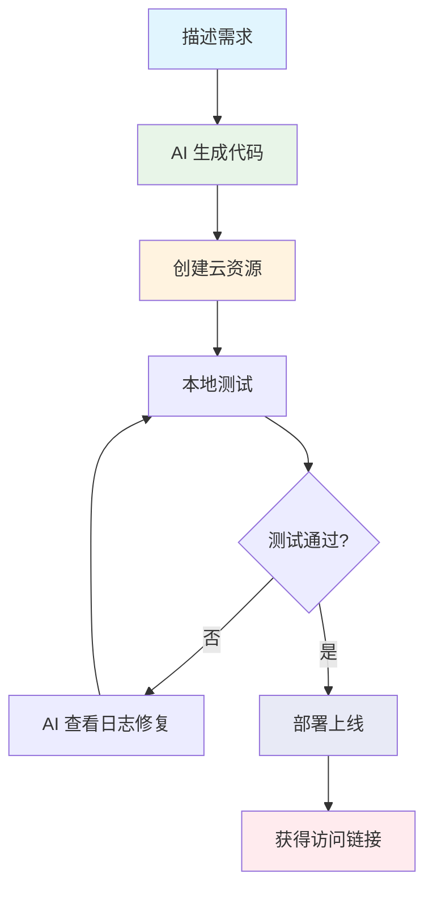

# 快速开始

欢迎使用 **CloudBase AI ToolKit**！通过自然语言描述需求，AI 自动生成代码并部署到腾讯云开发平台。

<div align="center">

[](https://github.com/TencentCloudBase/CloudBase-AI-ToolKit)
[](https://cnb.cool/tencent/cloud/cloudbase/CloudBase-AI-ToolKit)

</div>

## 🌟 核心能力

- **🤖 AI 智能开发**：自动生成代码和架构设计
- **☁️ 云开发集成**：一键接入数据库、云函数、静态托管
- **🚀 快速部署**：几分钟内完成全栈应用上线
- **📱 全栈支持**：Web + 小程序 + 后端一体化
- **🔧 智能修复**：AI 自动查看日志并修复问题

### 🎯 适用场景
快速原型、学习实践、业务开发、小程序开发

---

## 🚀 第一步：选择你的 AI 开发工具

选择你正在使用或计划使用的 AI 开发工具，点击查看详细配置指南：


| 工具 | 支持平台 | 查看指引 |
|------|----------|----------|
| [Cursor](https://docs.cloudbase.net/ai/cloudbase-ai-toolkit/ide-setup/cursor) | 独立 IDE| [查看指引](https://docs.cloudbase.net/ai/cloudbase-ai-toolkit/ide-setup/cursor) |
| [WindSurf](https://docs.cloudbase.net/ai/cloudbase-ai-toolkit/ide-setup/windsurf) | 独立 IDE, VSCode、JetBrains 插件 | [查看指引](https://docs.cloudbase.net/ai/cloudbase-ai-toolkit/ide-setup/windsurf) |
| [CodeBuddy](https://docs.cloudbase.net/ai/cloudbase-ai-toolkit/ide-setup/codebuddy) | VS Code、JetBrains、微信开发者工具、独立 IDE（推荐，已内置 CloudBase AI Toolkit） | [查看指引](https://docs.cloudbase.net/ai/cloudbase-ai-toolkit/ide-setup/codebuddy) |
| [CLINE](https://docs.cloudbase.net/ai/cloudbase-ai-toolkit/ide-setup/cline) | VS Code 插件 | [查看指引](https://docs.cloudbase.net/ai/cloudbase-ai-toolkit/ide-setup/cline) |
| [GitHub Copilot](https://docs.cloudbase.net/ai/cloudbase-ai-toolkit/ide-setup/github-copilot) | VS Code 插件 | [查看指引](https://docs.cloudbase.net/ai/cloudbase-ai-toolkit/ide-setup/github-copilot) |
| [Trae](https://docs.cloudbase.net/ai/cloudbase-ai-toolkit/ide-setup/trae) | 独立 IDE | [查看指引](https://docs.cloudbase.net/ai/cloudbase-ai-toolkit/ide-setup/trae) |
| [通义灵码](https://docs.cloudbase.net/ai/cloudbase-ai-toolkit/ide-setup/tongyi-lingma) | 独立 IDE，VS Code、 JetBrains插件 | [查看指引](https://docs.cloudbase.net/ai/cloudbase-ai-toolkit/ide-setup/tongyi-lingma) |
| [RooCode](https://docs.cloudbase.net/ai/cloudbase-ai-toolkit/ide-setup/roocode) | VS Code插件 | [查看指引](https://docs.cloudbase.net/ai/cloudbase-ai-toolkit/ide-setup/roocode) |
| [文心快码](https://docs.cloudbase.net/ai/cloudbase-ai-toolkit/ide-setup/baidu-comate) | VS Code、JetBrains插件| [查看指引](https://docs.cloudbase.net/ai/cloudbase-ai-toolkit/ide-setup/baidu-comate) |
| [Augment Code](https://docs.cloudbase.net/ai/cloudbase-ai-toolkit/ide-setup/augment-code) | VS Code、JetBrains 插件 | [查看指引](https://docs.cloudbase.net/ai/cloudbase-ai-toolkit/ide-setup/augment-code) |
| [Claude Code](https://docs.cloudbase.net/ai/cloudbase-ai-toolkit/ide-setup/claude-code) | 命令行工具 | [查看指引](https://docs.cloudbase.net/ai/cloudbase-ai-toolkit/ide-setup/claude-code) |
| [Gemini CLI](https://docs.cloudbase.net/ai/cloudbase-ai-toolkit/ide-setup/gemini-cli) | 命令行工具 | [查看指引](https://docs.cloudbase.net/ai/cloudbase-ai-toolkit/ide-setup/gemini-cli) |
| [OpenAI Codex CLI](https://docs.cloudbase.net/ai/cloudbase-ai-toolkit/ide-setup/openai-codex-cli) | 命令行工具 | [查看指引](https://docs.cloudbase.net/ai/cloudbase-ai-toolkit/ide-setup/openai-codex-cli) |
| [OpenCode](https://docs.cloudbase.net/ai/cloudbase-ai-toolkit/ide-setup/opencode) | 命令行工具 | [查看指引](https://docs.cloudbase.net/ai/cloudbase-ai-toolkit/ide-setup/opencode) |
| [Qwen Code](https://docs.cloudbase.net/ai/cloudbase-ai-toolkit/ide-setup/qwen-code) | 命令行工具 | [查看指引](https://docs.cloudbase.net/ai/cloudbase-ai-toolkit/ide-setup/qwen-code) |

### 快速配置（通用）

如果你的工具暂时没有专门的指南，可以使用以下通用 MCP 配置：

```json
{
  "mcpServers": {
    "cloudbase": {
      "command": "npx",
      "args": ["npm-global-exec@latest", "@cloudbase/cloudbase-mcp@latest"]
    }
  }
}
```

配置完成后，在 AI 对话中输入以下内容验证：
```
检查 CloudBase 工具是否可用
```

## ✅ 第二步：验证环境

### 前置条件检查

<details>
<summary>✅ Node.js v18.15.0+ 已安装</summary>

确保您的计算机上安装了 Node.js v18.15.0 及以上版本。检查版本：
```bash
node --version
```
如果未安装，请从 [Node.js 官网](https://nodejs.org/) 下载安装。

</details>

<details>
<summary>☁️ 开通云开发环境</summary>

访问 [腾讯云开发控制台](https://tcb.cloud.tencent.com/dev) 开通环境，新用户可以免费开通体验。

</details>

<details>
<summary>🚀 可选：加速配置</summary>

**设置 npm 镜像源**（提高下载速度）：
```bash
npm config set registry https://mirrors.cloud.tencent.com/npm/
```

**清理 npx 缓存**（避免安装问题）：
```bash
npx clear-npx-cache
```

</details>

## 🎯 第三步：选择项目模板

### 📦 使用现成模板（推荐新手）

我们为你准备了多种技术栈的项目模板，内置云开发最佳实践和 AI 规则：

- **📱 微信小程序** + 云开发
- **⚛️ React Web** + 云开发  
- **💚 Vue Web** + 云开发
- **🦄 UniApp** 跨端应用 + 云开发
- **🛠️ 通用模板**（适用于任意技术栈）

**👉 [查看所有项目模板](./templates)**

选择合适的模板后，只需对 AI 说：
```
下载 [模板名称] 到当前目录
```

如果你只想下载特定IDE的配置文件，避免项目文件混乱，可以指定IDE类型：
```
下载小程序云开发模板，只包含Cursor配置
下载React云开发模板，只包含WindSurf配置
下载通用云开发模板，只包含Claude Code配置
```

### 🔧 增强现有项目

如果你已经有项目，只需对 AI 说：

```
在当前项目中下载云开发 AI 规则
```

AI 会自动下载并配置云开发规则到你的项目中。同样支持指定IDE类型：
```
在当前项目中下载云开发 AI 规则，只包含Cursor配置
在当前项目中下载云开发 AI 规则，只包含WindSurf配置
```

## 🔐 第四步：登录云开发

在 AI 对话中输入：

```
登录云开发
```

AI 会自动：
- 弹出腾讯云登录界面
- 展示可用的云开发环境
- 完成环境选择和配置

### 验证登录状态

```
查询当前云开发环境信息
```

## 🚀 第五步：开始开发

现在你可以通过自然语言描述需求，让 AI 帮你开发应用：

### 示例需求

```
帮我创建一个待办事项应用，包含：
- 添加、删除、编辑待办事项
- 数据存储到云数据库
- 支持标记完成状态
- 部署到云端
```

```
创建一个简单的博客系统，需要：
- 文章列表页面
- 文章详情页面  
- 文章发布功能
- 数据存储到云数据库
```

### 💡 开发技巧

- **详细描述**：越详细的需求描述，AI 生成的代码越准确
- **增量开发**：可以逐步添加功能，比如先实现基础功能，再添加高级特性
- **错误处理**：遇到问题时，把完整的错误信息提供给 AI
- **日志调试**：可以要求 AI 查看云函数日志进行问题诊断

## 🎯 典型开发流程



## 🔧 调试和问题修复

### 遇到错误时

```
报错了，错误信息是：[粘贴完整错误信息]
```

### 云函数调试

```
云函数运行异常，需求是 [描述原本的需求]，请查看日志进行调试和修复
```

### 环境切换

如需切换云开发环境：

```
退出云开发
```

然后重新登录选择其他环境。

## 🎉 完成！你已准备就绪

✅ AI 开发工具已配置  
✅ 云开发环境已连接  
✅ 项目模板已准备  
✅ 开发流程已了解  

现在开始用自然语言描述你的应用需求，让 AI 帮你快速构建全栈应用吧！

## 📚 进阶学习

- 📖 [项目模板详解](./templates) - 深入了解各种项目模板
- 💻 [开发最佳实践](./development) - 掌握高级开发技巧  
- 🎯 [实际案例](./examples) - 学习真实项目经验
- 🛠️ [MCP 工具参考](./mcp-tools) - 了解所有可用工具 
- ❓ [常见问题](./faq) - 解决开发中的问题

---

<div align="center">

💫 如果这个项目对你有帮助，欢迎给我们一个 ⭐ Star！

[](https://github.com/TencentCloudBase/CloudBase-AI-ToolKit) [](https://cnb.cool/tencent/cloud/cloudbase/CloudBase-AI-ToolKit)

</div>