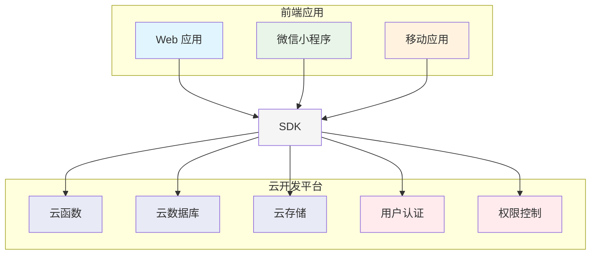
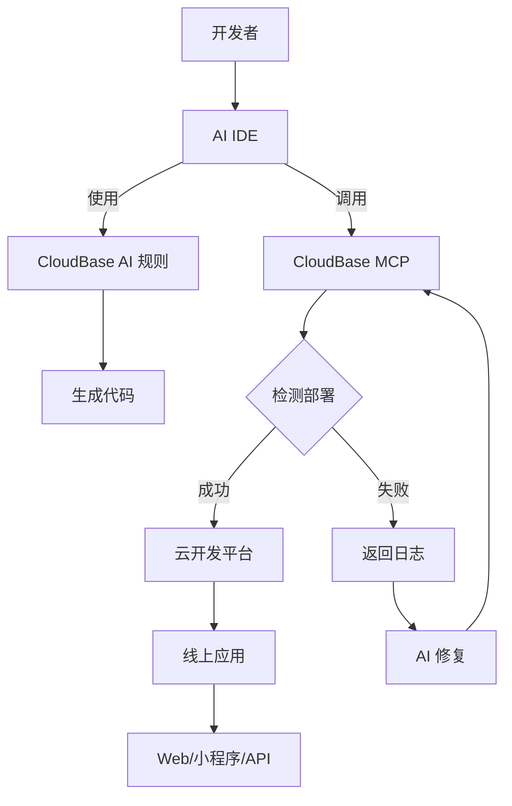

# CloudBase AI ToolKit 概述

<div align="center">


**
🪐 用 AI IDE 一键生成、部署和托管你的全栈 Web 应用与小程序、数据库和后端服务，无需运维，极速上线你的创意 💫**


[](https://github.com/TencentCloudBase/CloudBase-AI-ToolKit)
[](https://cnb.cool/tencent/cloud/cloudbase/CloudBase-AI-ToolKit)

</div>

当你在**Cursor/ VSCode GitHub Copilot/WinSurf/CodeBuddy/Augment Code/Claude Code/OpenAI Codex CLI/OpenCode**等AI编程工具里写代码时，它能自动帮你生成可直接部署的前后端应用+小程序，并一键发布到腾讯云开发 CloudBase。

:::tip 🌟 开源项目
- **GitHub 仓库**: [TencentCloudBase/CloudBase-AI-ToolKit](https://github.com/TencentCloudBase/CloudBase-AI-ToolKit) - 欢迎 Star 和贡献代码
- **CNB 社区**: [CloudBase-AI-ToolKit](https://cnb.cool/tencent/cloud/cloudbase/CloudBase-AI-ToolKit) - 中国开发者社区
:::


**📹 完整视频演示 ⬇️**

<a href="https://www.bilibili.com/video/BV1hpjvzGESg/" target="_blank">
  
</a>


| 🚀 **核心能力** | 🛠️ **支持平台** |
|---|---|
| 🤖 **AI智能开发**: AI自动生成代码和架构设计<br/>☁️ **云开发集成**: 一键接入数据库、云函数、静态托管<br/>⚡ **快速部署**: 几分钟内完成全栈应用上线 | **Web应用**: 现代化前端 + 静态托管<br/>**微信小程序**: 云开发小程序解决方案<br/>**后端服务**: 云数据库 + 无服务器函数+云托管 |


## ✨ 核心特性

- **🤖 AI 原生** - 专为 AI 编程工具设计的规则库，生成代码符合云开发最佳实践
- **🚀 一键部署** - MCP 自动化部署到腾讯云开发 CloudBase 平台，Serverless 架构无需购买服务器
- **📱 全栈应用** - Web + 小程序 + 数据库 + 后端一体化，支持多种应用形式和后端托管
- **🔧 智能修复** - AI 自动查看日志并修复问题，降低运维成本
- **⚡ 极速体验** - 国内 CDN 加速，比海外平台访问速度更快
- **📚 知识检索** - 内置云开发、微信小程序等专业知识库的智能向量检索

---
🚩 **快速上手 CloudBase AI ToolKit**

1. **启用 CloudBase 工具（MCP 配置）**  
在你的 AI IDE（如 Cursor）中添加以下配置，即可启用 CloudBase AI ToolKit 的全部能力：

```json
{
  "mcpServers": {
    "cloudbase": {
      "command": "npx",
      "args": ["npm-global-exec@latest", "@cloudbase/cloudbase-mcp@latest"]
    }
  }
}
```

2. **一键生成项目模板**  
在 AI 对话框输入：

```
下载小程序云开发模板
```

如果你只想下载特定IDE的配置文件，避免项目文件混乱，可以指定IDE类型：
```
下载小程序云开发模板，只包含Cursor配置
下载React云开发模板，只包含WindSurf配置
下载通用云开发模板，只包含Claude Code配置
```

3. **可选模板类型**  
- 小程序云开发模板
- React 云开发模板
- Vue 云开发模板
- UniApp 云开发模板
- 通用云开发模板

👉 [查看全部官方模板及说明](https://docs.cloudbase.net/ai/cloudbase-ai-toolkit/templates)

4. **详细教程**  
👉 [查看完整配置与使用教程](#💻-支持的-ai-开发工具)

---

## 💻 支持的 AI 开发工具

| 工具 | 支持平台 | 查看指引 |
|------|----------|----------|
| [Cursor](https://docs.cloudbase.net/ai/cloudbase-ai-toolkit/ide-setup/cursor) | 独立 IDE| [查看指引](https://docs.cloudbase.net/ai/cloudbase-ai-toolkit/ide-setup/cursor) |
| [WindSurf](https://docs.cloudbase.net/ai/cloudbase-ai-toolkit/ide-setup/windsurf) | 独立 IDE, VSCode、JetBrains 插件 | [查看指引](https://docs.cloudbase.net/ai/cloudbase-ai-toolkit/ide-setup/windsurf) |
| [CodeBuddy](https://docs.cloudbase.net/ai/cloudbase-ai-toolkit/ide-setup/codebuddy) | VS Code、JetBrains、微信开发者工具、独立 IDE（推荐，已内置 CloudBase AI Toolkit） | [查看指引](https://docs.cloudbase.net/ai/cloudbase-ai-toolkit/ide-setup/codebuddy) |
| [CLINE](https://docs.cloudbase.net/ai/cloudbase-ai-toolkit/ide-setup/cline) | VS Code 插件 | [查看指引](https://docs.cloudbase.net/ai/cloudbase-ai-toolkit/ide-setup/cline) |
| [GitHub Copilot](https://docs.cloudbase.net/ai/cloudbase-ai-toolkit/ide-setup/github-copilot) | VS Code 插件 | [查看指引](https://docs.cloudbase.net/ai/cloudbase-ai-toolkit/ide-setup/github-copilot) |
| [Trae](https://docs.cloudbase.net/ai/cloudbase-ai-toolkit/ide-setup/trae) | 独立 IDE | [查看指引](https://docs.cloudbase.net/ai/cloudbase-ai-toolkit/ide-setup/trae) |
| [通义灵码](https://docs.cloudbase.net/ai/cloudbase-ai-toolkit/ide-setup/tongyi-lingma) | 独立 IDE，VS Code、 JetBrains插件 | [查看指引](https://docs.cloudbase.net/ai/cloudbase-ai-toolkit/ide-setup/tongyi-lingma) |
| [RooCode](https://docs.cloudbase.net/ai/cloudbase-ai-toolkit/ide-setup/roocode) | VS Code插件 | [查看指引](https://docs.cloudbase.net/ai/cloudbase-ai-toolkit/ide-setup/roocode) |
| [文心快码](https://docs.cloudbase.net/ai/cloudbase-ai-toolkit/ide-setup/baidu-comate) | VS Code、JetBrains插件| [查看指引](https://docs.cloudbase.net/ai/cloudbase-ai-toolkit/ide-setup/baidu-comate) |
| [Augment Code](https://docs.cloudbase.net/ai/cloudbase-ai-toolkit/ide-setup/augment-code) | VS Code、JetBrains 插件 | [查看指引](https://docs.cloudbase.net/ai/cloudbase-ai-toolkit/ide-setup/augment-code) |
| [Claude Code](https://docs.cloudbase.net/ai/cloudbase-ai-toolkit/ide-setup/claude-code) | 命令行工具 | [查看指引](https://docs.cloudbase.net/ai/cloudbase-ai-toolkit/ide-setup/claude-code) |
| [Gemini CLI](https://docs.cloudbase.net/ai/cloudbase-ai-toolkit/ide-setup/gemini-cli) | 命令行工具 | [查看指引](https://docs.cloudbase.net/ai/cloudbase-ai-toolkit/ide-setup/gemini-cli) |
| [OpenAI Codex CLI](https://docs.cloudbase.net/ai/cloudbase-ai-toolkit/ide-setup/openai-codex-cli) | 命令行工具 | [查看指引](https://docs.cloudbase.net/ai/cloudbase-ai-toolkit/ide-setup/openai-codex-cli) |
| [OpenCode](https://docs.cloudbase.net/ai/cloudbase-ai-toolkit/ide-setup/opencode) | 命令行工具 | [查看指引](https://docs.cloudbase.net/ai/cloudbase-ai-toolkit/ide-setup/opencode) |
| [Qwen Code](https://docs.cloudbase.net/ai/cloudbase-ai-toolkit/ide-setup/qwen-code) | 命令行工具 | [查看指引](https://docs.cloudbase.net/ai/cloudbase-ai-toolkit/ide-setup/qwen-code) |

## 🎯 快速导航

- [快速开始](./getting-started) - 几分钟内上手使用
- [IDE配置](./ide-setup/cursor) - 配置你的AI开发工具
- [项目模板](./templates) - 选择合适的项目模板
- [开发指南](./development) - 深入了解开发最佳实践
- [使用案例](./examples) - 查看实际应用案例
- [教程](./tutorials) - 编程实战、AI Coding组合、应用项目和视频教程
- [插件系统](./plugins) - 按需启用工具模块
- [MCP工具](./mcp-tools) - 了解所有可用工具
- [MCP上架材料](./mcp-listing-materials.md) - 第三方市场上架材料（英文）
- [MCP上架材料](./mcp-listing-materials-zh.md) - 第三方市场上架材料（中文）
- [常见问题](./troubleshooting) - 解决开发中的问题
- [FAQ](./faq) - 查看常见问题解答

## ☁️ 云开发平台架构



## 🏗️ AI + 云开发工作流



## 🌟 为什么选择 CloudBase？

- **⚡ 极速部署**：国内节点,访问速度比海外更快
- **🛡️ 稳定可靠**：330 万开发者选择的 Serverless 平台
- **🔧 开发友好**：专为AI时代设计的全栈平台，支持自动环境配置
- **💰 成本优化**：Serverless 架构更具弹性，新用户开发期间可以免费体验

如有迁移、集成等常见疑问，请查阅 [FAQ 常见问题](https://docs.cloudbase.net/ai/cloudbase-ai-toolkit/faq)。

## 💬 技术交流群

遇到问题或想要交流经验？加入我们的技术社区！

### 🔥 微信交流群

<div align="center">

<br/>
<i>扫码加入微信技术交流群</i>
</div>