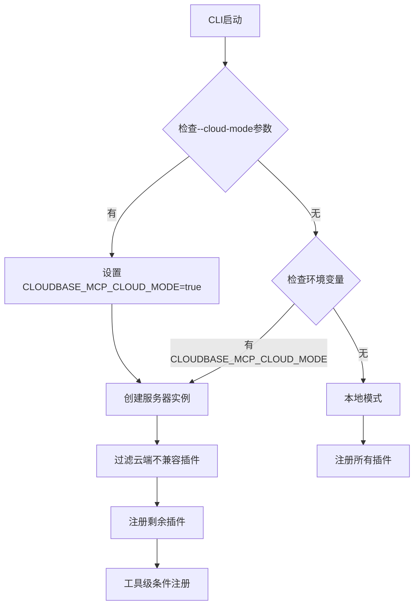
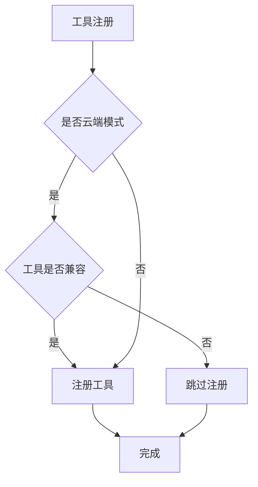

# 技术方案设计

## 架构概述

本次优化将为CloudBase MCP增加云端运行模式支持，通过环境检测、认证隔离、配置隔离和工具过滤四个层面确保多租户云端环境下的安全运行。

## 技术栈

- **核心语言**: TypeScript
- **主要组件**: 
  - `cli.ts` - CLI入口和参数解析
  - `server.ts` - 服务器创建和插件管理
  - `auth.ts` - 认证状态管理
  - `cloudbase-manager.ts` - 环境ID管理
  - `tools/*.ts` - 各种工具模块
  - `utils/cloud-mode.ts` - 云端模式检测和工具过滤

## 技术选型

### 1. 云端模式检测机制

创建统一的云端模式检测模块：

```typescript
// utils/cloud-mode.ts
export function isCloudMode(): boolean {
  return process.env.CLOUDBASE_MCP_CLOUD_MODE === 'true' || 
         process.env.MCP_CLOUD_MODE === 'true';
}

export function enableCloudMode(): void {
  process.env.CLOUDBASE_MCP_CLOUD_MODE = 'true';
}
```

### 2. 认证状态隔离方案

修改`auth.ts`，在云端模式下绕过本地认证缓存：

```typescript
export async function getLoginState() {
  const {
    TENCENTCLOUD_SECRETID,
    TENCENTCLOUD_SECRETKEY,
    TENCENTCLOUD_SESSIONTOKEN
  } = process.env;

  // 云端模式：直接构造认证状态
  if (TENCENTCLOUD_SECRETID && TENCENTCLOUD_SECRETKEY) {
    return {
      isLoggedIn: true,
      credential: {
        secretId: TENCENTCLOUD_SECRETID,
        secretKey: TENCENTCLOUD_SECRETKEY,
        token: TENCENTCLOUD_SESSIONTOKEN
      }
    };
  }

  // 本地模式：使用原有逻辑
  // ... existing logic
}
```

### 3. 环境ID管理隔离

修改`cloudbase-manager.ts`的环境ID获取逻辑：

```typescript
private async _fetchEnvId(): Promise<string> {
  try {
    // 1. 检查进程环境变量（云端和本地都适用）
    if (process.env.CLOUDBASE_ENV_ID) {
      this.cachedEnvId = process.env.CLOUDBASE_ENV_ID;
      return this.cachedEnvId;
    }

    // 2. 本地模式：从配置文件读取和自动设置
    // ... existing local logic
  }
}
```

### 4. 插件级工具过滤机制

在`server.ts`中实现云端模式工具过滤：

```typescript
// 定义云端不兼容的插件
const CLOUD_INCOMPATIBLE_PLUGINS = [
  'interactive',  // 包含本地服务器和文件操作
  'setup'        // 涉及本地配置文件操作
];

function parseEnabledPlugins(): string[] {
  // ... existing logic
  
  // 云端模式过滤
  if (isCloudMode()) {
    enabledPlugins = enabledPlugins.filter(p => 
      !CLOUD_INCOMPATIBLE_PLUGINS.includes(p)
    );
  }
  
  return enabledPlugins;
}
```

### 5. 工具级条件注册机制

新增工具级别的精确过滤：

```typescript
// 云端不兼容工具列表
const cloudIncompatibleTools = [
  'uploadFile',           // 本地文件上传到云存储
  'uploadFiles',          // 本地文件上传到静态托管
  'updateFunctionCode',   // 本地代码包上传
  'createFunction',       // 本地代码创建云函数
  'downloadTemplate',     // 本地模板下载
  'downloadRemoteFile',   // 本地文件下载
  'interactiveDialog'     // 本地服务器交互
];

export function shouldRegisterTool(toolName: string): boolean {
  if (!isCloudMode()) return true;
  return !cloudIncompatibleTools.includes(toolName);
}

export function conditionalRegisterTool(
  server: any,
  toolName: string,
  toolConfig: any,
  handler: any
): void {
  if (shouldRegisterTool(toolName)) {
    server.registerTool?.(toolName, toolConfig, handler);
  }
}
```

### 6. CLI参数支持

修改`cli.ts`添加云端模式参数：

```typescript
// 解析命令行参数
const args = process.argv.slice(2);
const hasCloudModeFlag = args.includes('--cloud-mode');

// 启用云端模式
if (hasCloudModeFlag) {
  enableCloudMode();
}
```

## 数据流设计

### 云端模式启动流程



### 工具注册流程



## 安全考虑

1. **环境隔离**: 云端模式完全依赖环境变量，避免文件系统污染
2. **工具限制**: 过滤危险的本地操作工具
3. **认证安全**: 不在本地存储认证状态
4. **配置隔离**: 不读写用户配置文件
5. **精确过滤**: 工具级别的精确控制

## 性能考虑

1. **快速模式检测**: 使用环境变量进行O(1)模式判断
2. **缓存优化**: 云端模式下减少不必要的文件I/O
3. **工具过滤**: 在服务器创建时一次性过滤，避免运行时判断
4. **条件注册**: 只在需要时进行工具注册判断

## 兼容性策略

1. **向后兼容**: 不影响现有本地模式的使用
2. **渐进升级**: 新增云端模式作为可选功能
3. **配置兼容**: 支持多种启用方式（CLI参数、环境变量、配置选项）
4. **工具兼容**: 保持工具接口不变，只改变注册逻辑

## 测试策略

1. **单元测试**: 测试云端模式检测和工具过滤逻辑
2. **集成测试**: 测试云端模式下的完整工作流
3. **隔离测试**: 验证多进程间的环境隔离效果
4. **兼容性测试**: 验证本地模式的正常使用
