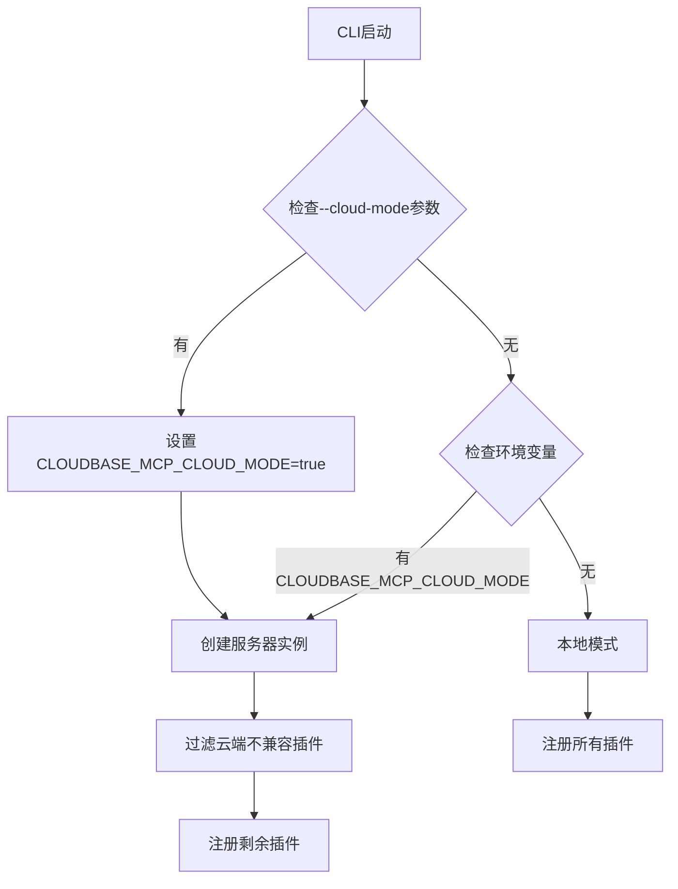
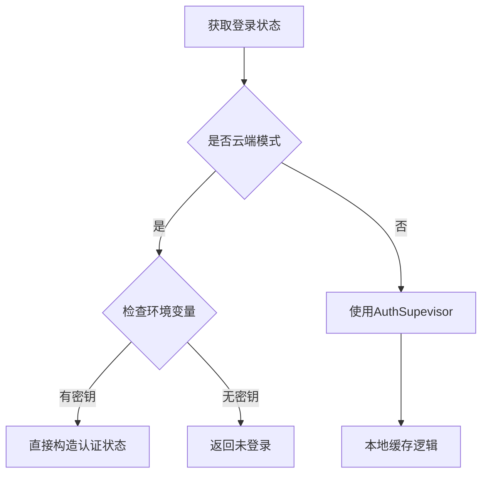

# 技术方案设计

## 架构概述

本次优化将为CloudBase MCP增加云端运行模式支持，通过环境检测、认证隔离、配置隔离和工具过滤四个层面确保多租户云端环境下的安全运行。

## 技术栈

- **核心语言**: TypeScript
- **主要组件**: 
  - `cli.ts` - CLI入口和参数解析
  - `server.ts` - 服务器创建和插件管理
  - `auth.ts` - 认证状态管理
  - `cloudbase-manager.ts` - 环境ID管理
  - `tools/interactive.ts` - 交互工具和环境配置

## 技术选型

### 1. 云端模式检测机制

创建统一的云端模式检测模块：

```typescript
// utils/cloud-mode.ts
export function isCloudMode(): boolean {
  return process.env.CLOUDBASE_MCP_CLOUD_MODE === 'true' || 
         process.env.MCP_CLOUD_MODE === 'true';
}

export function enableCloudMode(): void {
  process.env.CLOUDBASE_MCP_CLOUD_MODE = 'true';
}
```

### 2. 认证状态隔离方案

修改`auth.ts`，在云端模式下绕过本地认证缓存：

```typescript
export async function getLoginState() {
  const {
    TENCENTCLOUD_SECRETID,
    TENCENTCLOUD_SECRETKEY,
    TENCENTCLOUD_SESSIONTOKEN
  } = process.env;

  // 云端模式：直接构造认证状态
  if (isCloudMode() && TENCENTCLOUD_SECRETID && TENCENTCLOUD_SECRETKEY) {
    return {
      isLoggedIn: true,
      credential: {
        secretId: TENCENTCLOUD_SECRETID,
        secretKey: TENCENTCLOUD_SECRETKEY,
        token: TENCENTCLOUD_SESSIONTOKEN
      }
    };
  }

  // 本地模式：使用原有逻辑
  // ... existing logic
}
```

### 3. 环境ID管理隔离

修改`cloudbase-manager.ts`的环境ID获取逻辑：

```typescript
private async _fetchEnvId(): Promise<string> {
  try {
    // 1. 检查进程环境变量（云端和本地都适用）
    if (process.env.CLOUDBASE_ENV_ID) {
      debug('使用进程环境变量的环境ID:', process.env.CLOUDBASE_ENV_ID);
      this.cachedEnvId = process.env.CLOUDBASE_ENV_ID;
      return this.cachedEnvId;
    }

    // 2. 云端模式：强制要求环境变量
    if (isCloudMode()) {
      throw new Error("Cloud mode requires CLOUDBASE_ENV_ID environment variable");
    }

    // 3. 本地模式：从配置文件读取和自动设置
    // ... existing local logic
  }
}
```

### 4. 工具过滤机制

在`server.ts`中实现云端模式工具过滤：

```typescript
// 定义云端不兼容的插件
const CLOUD_INCOMPATIBLE_PLUGINS = [
  'interactive',  // 包含本地服务器和文件操作
  'setup'        // 涉及本地配置文件操作
];

// 定义云端不兼容的具体工具
const CLOUD_INCOMPATIBLE_TOOLS = [
  'setupEnvironmentId',
  'downloadTemplate',
  'clearUserEnvId'
];

function parseEnabledPlugins(): string[] {
  let enabledPlugins: string[];
  
  // ... existing logic
  
  // 云端模式过滤
  if (isCloudMode()) {
    enabledPlugins = enabledPlugins.filter(p => 
      !CLOUD_INCOMPATIBLE_PLUGINS.includes(p)
    );
    debug('云端模式已过滤插件:', CLOUD_INCOMPATIBLE_PLUGINS);
  }
  
  return enabledPlugins;
}
```

### 5. CLI参数支持

修改`cli.ts`添加云端模式参数：

```typescript
import { parseArgs } from 'node:util';

// 解析命令行参数
const { values } = parseArgs({
  args: process.argv.slice(2),
  options: {
    'cloud-mode': {
      type: 'boolean',
      default: false
    }
  },
  allowPositionals: false
});

// 设置云端模式
if (values['cloud-mode']) {
  enableCloudMode();
}
```

## 数据流设计

### 云端模式启动流程



### 认证状态管理流程



## 安全考虑

1. **环境隔离**: 云端模式完全依赖环境变量，避免文件系统污染
2. **工具限制**: 过滤危险的本地操作工具
3. **认证安全**: 不在本地存储认证状态
4. **配置隔离**: 不读写用户配置文件

## 性能考虑

1. **快速模式检测**: 使用环境变量进行O(1)模式判断
2. **缓存优化**: 云端模式下减少不必要的文件I/O
3. **工具过滤**: 在服务器创建时一次性过滤，避免运行时判断

## 兼容性策略

1. **向后兼容**: 不影响现有本地模式的使用
2. **渐进升级**: 新增云端模式作为可选功能
3. **配置兼容**: 支持多种启用方式（CLI参数、环境变量、配置选项）

## 测试策略

1. **单元测试**: 测试云端模式检测和工具过滤逻辑
2. **集成测试**: 测试云端模式下的完整工作流
3. **隔离测试**: 验证多进程间的环境隔离效果
